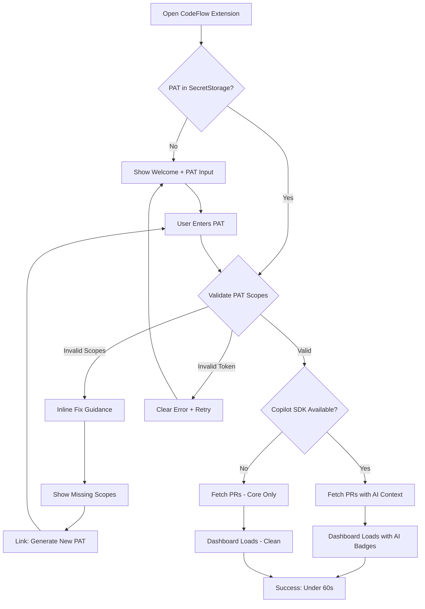
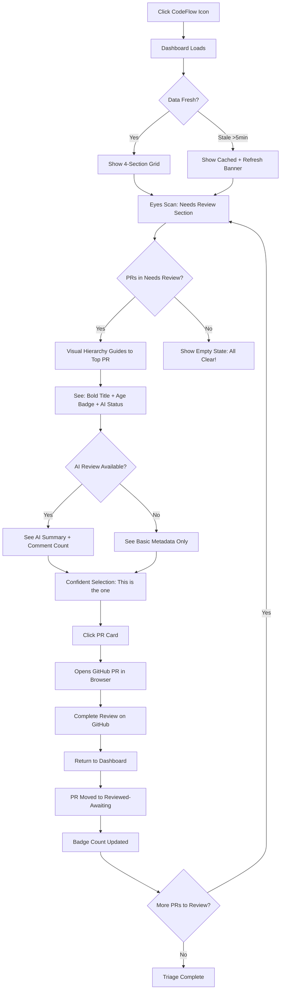
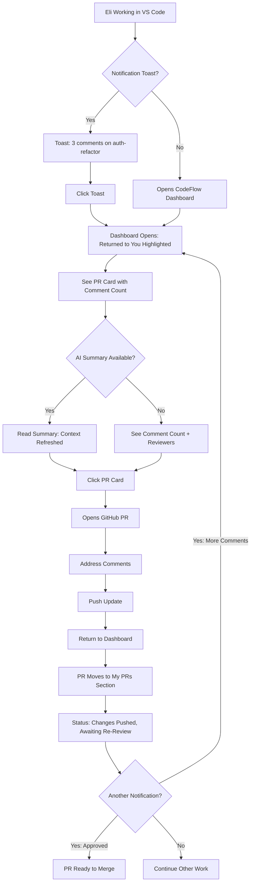
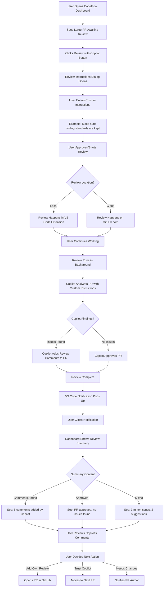
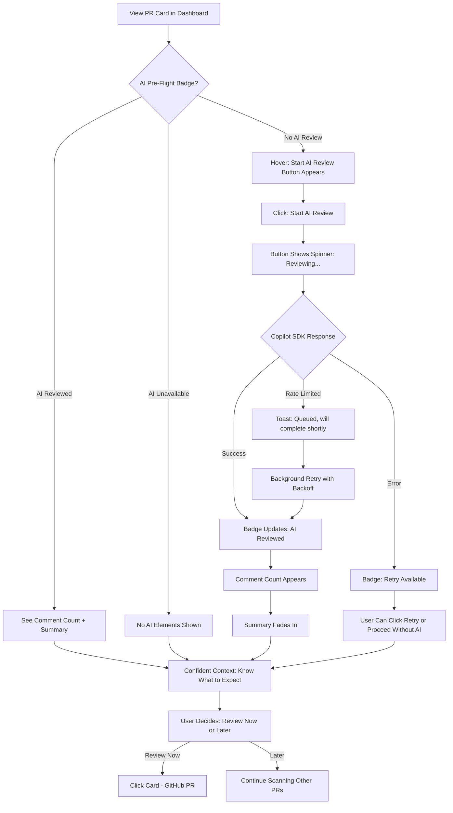

# UX Design Specification: CodeFlow

**Author:** Aviram  
**Date:** January 21, 2026  
**Revised:** January 29, 2026 (VS Code Extension pivot)

---

<!-- UX design content will be appended sequentially through collaborative workflow steps -->

## Executive Summary

### Project Vision

CodeFlow transforms pull request management from a notification treadmill into an outcome-focused workflow accelerator. The platform addresses the fundamental gap between GitHub's event-based notifications and developer productivity by providing intelligent PR categorization, automated coordination, and seamless chat integration. CodeFlow eliminates the social awkwardness of manual PR reminders while giving reviewers clarity on where to focus their attention.

**Core Innovation:** Shift from "what happened" (PR updated) to "what needs to be done" (3 comments need addressing, approved and ready to merge). Meet developers in their communication tools, not just their code tools.

### Target Users

**Primary Persona: The Overwhelmed Reviewer**
Mid-size development team member (5-15 developer teams) juggling 10-50 PRs weekly. Spends 20-30 minutes daily triaging GitHub notifications, experiencing decision paralysis when faced with multiple PRs awaiting review. Frustrated by lack of intelligent prioritization and guilt from growing review backlog.

**Secondary Persona: The Blocked Author**
Developer waiting on PR reviews to unblock their work. Experiences social awkwardness from manual reminder pings, misses when reviews are complete and changes need addressing. Loses momentum during 24-48 hour review cycle gaps that compound into significant delays.

**Team Context:**
Teams already using chat-based coordination (e.g., manual Teams channels with emoji reactions for PR status). Need visibility into review bottlenecks without micromanagement oversight.

### Key Design Challenges

**1. Decision Paralysis Reduction**
Reviewers face cognitive overload when presented with multiple PRs requiring attention. Without intelligent prioritization, they default to chronological ordering or random selection, missing time-sensitive or expertise-matched opportunities. UX must provide clear "start here" guidance while maintaining user autonomy.

**2. Social Coordination Automation**
Manual PR reminders create emotional labor and team friction. Current workarounds (dedicated chat channels with manual status updates) prove the need but require constant discipline. UX must automate coordination while preserving team transparency and individual agency.

**3. Review Cycle Context Preservation**
The biggest productivity killer isn't slow initial reviews—it's the gaps between review cycles where everyone forgets context. PR authors miss when reviews complete; reviewers lose track of PRs they've reviewed awaiting author responses. UX must maintain contextual continuity across the entire review lifecycle.

**4. Platform Integration Without Fragmentation**
Developers context-switch between GitHub (code review), chat tools (coordination), and CodeFlow (management). Each transition costs cognitive energy. UX must minimize fragmentation while respecting existing tool preferences and workflows.

### Design Opportunities

**1. AI-First Triage as Competitive Moat (Copilot SDK from Day 1)**
CodeFlow is positioned as one of the first VS Code extensions to leverage GitHub Copilot SDK. MVP includes:
- **AI Pre-Flight Status:** Badges showing Copilot review state before user opens PR
- **One-Click AI Review:** Trigger Copilot reviews directly from dashboard cards
- **Semantic Risk Labels:** AI-derived descriptors ("Refactor", "Critical Logic", "Config Change") replacing generic size labels
- **AI Summaries:** TL;DR for each PR to accelerate triage decisions

**2. Intelligent Prioritization Through Visual Hierarchy**
Clear visual signals based on PR age, AI risk assessment, and Copilot comment counts. The interface guides reviewers to their most impactful review without manual scanning.

**3. Gentle Automation of Social Dynamics**
Automate the "awkward reminder" problem with VS Code notifications that feel helpful rather than nagging. Phase 2 adds Slack/Teams integration via GitHub Actions.

**4. Outcome-Focused Communication**
Transform notification fatigue into actionable clarity. Every message answers "what do I need to do?" rather than "what happened?" VS Code toasts and activity bar badges provide ambient awareness.

**5. In-Editor Workflow Acceleration**
Meet developers where they already are. No browser tab switching, no separate app. PR triage happens in the same window as code editing, reducing cognitive overhead.

## Core User Experience

### Defining Experience

**The Core Loop: Effortless PR Triage and Action**

CodeFlow's defining experience is the **instant clarity moment** - opening the dashboard and immediately knowing "what needs MY attention right now" without cognitive overhead. The primary user action is the **3-minute daily triage**: scan four intelligently categorized sections, identify priority actions, and execute reviews or updates with minimal friction.

**For Reviewers (Primary):** The critical interaction is **eliminating decision paralysis** - the dashboard answers "which PR should I review first?" through visual hierarchy, age indicators, and clear urgency signals. Users don't pick randomly or chronologically; the interface guides them to their most impactful review.

**For Authors (Secondary):** The critical interaction is **automatic status awareness** - knowing when reviews complete and feedback needs addressing without manual checking or social awkwardness of asking. The "Returned to You" section surfaces this instantly.

**Success Metric:** User opens CodeFlow, spends <30 seconds scanning, knows exactly their next action.

### Platform Strategy

**Primary Platform:** VS Code Extension with React webview dashboard

**Viewport Constraints:**
- **Sidebar Panel:** 300-400px width (primary use case)
- **Editor Panel:** 400-800px width (expanded view when docked in editor area)
- **Full Panel:** 600-1200px width (bottom panel, less common)

**Input Paradigm:** Keyboard-first with mouse support — developers are already in VS Code, hands on keyboard

**Platform Rationale:**
- **Zero context-switch:** Developers already live in VS Code during code work
- **Copilot SDK access:** Extension host enables native Copilot integration for AI features
- **PAT authentication:** No OAuth app approval friction — works immediately in enterprise
- **VS Code Marketplace:** Built-in distribution channel with trusted install experience
- **Theme integration:** Inherits user's VS Code theme (dark/light) automatically

**In-Editor Advantages:**
- PR triage happens where code review actions begin
- One click from dashboard → GitHub PR in browser (or use GitHub PR extension)
- VS Code notifications appear in activity bar, not lost in browser tabs
- Keyboard shortcuts integrate with VS Code's shortcut system

**Connectivity:** Online-only — GitHub API access required for PR data, Copilot SDK requires authenticated CLI

**Graceful Degradation:**
- Core dashboard works without Copilot SDK (AI features hidden)
- Cached data shown when GitHub API rate-limited
- Clear "last updated" timestamps build trust

### Effortless Interactions

**1. Zero-Thought Prioritization**
Opening the dashboard immediately reveals "start here" - no scanning, no analysis paralysis, no decision fatigue. Visual hierarchy through urgency indicators, AI risk labels, and strategic positioning eliminates "which PR?" questions.

**2. AI-Assisted Context**
AI Pre-Flight badges and summaries provide context *before* clicking into a PR. One-Click AI Review triggers Copilot analysis directly from the dashboard. Semantic Risk Labels replace generic size indicators with meaningful descriptors.

**3. Real-Time Status Synchronization**
Dashboard updates reflect GitHub state within 60 seconds without manual refresh. Users never question "is this current?" - timestamp indicators and auto-refresh provide confidence.

**4. One-Click Deep Links**
Every PR card links directly to relevant GitHub context (review interface, specific comment threads, file diffs). No navigation hunting, no tab proliferation - click and you're exactly where you need to be.

**5. Ambient Notifications**
VS Code activity bar badges and toast notifications answer "what do I need to do?" not "what happened?" — "3 comments need addressing in auth-refactor PR" vs "PR updated." Phase 2 adds Slack/Teams via GitHub Actions for out-of-editor awareness.

### Critical Success Moments

**1. First Dashboard Load (New User)**
User enters PAT, grants GitHub access, sees their first populated dashboard. **Success:** They immediately understand the four-section model and identify their first action within 30 seconds. AI badges and summaries provide instant context. **Failure:** Confusion about categorization logic or empty states that feel broken.

**2. Reviewer Picks First PR (Decision Point)**
User has 8 PRs in "Needs Review" section. **Success:** Visual hierarchy + AI Risk Labels guide them to most important PR. Semantic labels like "Critical Logic" signal priority. They feel confident "this is the right one to review first." **Failure:** All 8 PRs look equally important, user picks randomly (decision paralysis not solved).

**3. Author Realizes PR Needs Re-Review (Returned to You)**
Reviewers finished commenting 2 hours ago. **Success:** User opens CodeFlow, "Returned to You" section prominently shows PR with clear "3 unresolved comments" indicator. AI summary reminds them of context. **Failure:** User misses notification, PR sits idle for 24 hours, review cycle delays compound.

**4. One-Click AI Review (AI-First Triage)**
PR has no AI context yet. **Success:** User clicks "Start AI Review" from dashboard, sees immediate feedback, receives AI summary and risk label within seconds. They now have context without opening GitHub. **Failure:** AI feature is confusing or unavailable without clear fallback.

**5. Copilot Unavailable (Graceful Degradation)**
User doesn't have Copilot CLI installed. **Success:** Dashboard works perfectly, AI features are simply hidden (not broken). User gets full value from categorization and visual hierarchy. Optional hint in settings about Copilot. **Failure:** Error messages, broken UI, feeling that tool requires Copilot.

### Experience Principles

**1. Clarity Over Customization**
Every design decision prioritizes immediate comprehension over user configuration. Sensible defaults eliminate setup overhead. Power users get keyboard shortcuts and filters, but 80% of users succeed with zero configuration.

**2. Outcome-Focused Communication**
Never tell users "what happened" without "what to do about it." Every notification, every section header, every PR card answers: "What action does this require from me?"

**3. Respectful Automation**
Automate social awkwardness (reminders, nudges, status updates) while preserving human agency and collaborative tone. Never make users feel nagged, never make reviewers feel guilty - maintain team cohesion through helpful automation.

**4. Progressive Disclosure for Expertise**
Surface essential information immediately (PR title, status, age), reveal details on hover/click (file counts, comment threads, CI status). Support rapid scanning for power users, provide deeper context for careful decision-making.

**5. Platform Fluidity**
Minimize context switching pain through seamless deep linking, consistent visual language with GitHub, and chat-native notifications that respect communication tool preferences. Meet users where they work.

## Desired Emotional Response

### Primary Emotional Goals

**1. Relief and Control (Primary Emotion)**
The dominant feeling should be **"Ahhhh, I finally know what's going on."** - the opposite of GitHub notification overwhelm. Users feel in control of their PR workload rather than drowning in it. This is the emotional payoff of eliminating decision paralysis.

**2. Confidence in Decisions**
When picking which PR to review first, users should feel **"Yes, this IS the right one"** - not second-guessing or feeling guilty about the ones they didn't pick. The visual hierarchy provides emotional security.

**3. Team Harmony (Not Guilt or Awkwardness)**
PR authors feel **relief from social burden** - no more awkward reminder DMs. Reviewers feel **helpful collaboration** rather than guilt from notifications. Automated nudges create "we're all in this together" feeling instead of blame dynamics.

### Emotional Journey Mapping

**First Login (Discovery Phase):**
- **Initial:** Curiosity mixed with healthy skepticism ("Another dev tool?")
- **Dashboard loads:** Immediate "Ohhh, I get it!" clarity moment
- **After 30 seconds:** Confidence - "I know exactly what needs my attention"

**Daily Triage Routine:**
- **Opening CodeFlow:** Calm anticipation (vs GitHub anxiety)
- **Scanning dashboard:** Quick satisfaction - "This is manageable"
- **Picking PR to review:** Confidence in prioritization
- **After triage:** Accomplishment - "I know my next 3 actions"

**When PR Needs Re-Review:**
- **Seeing "Returned to You":** Immediate awareness (not frustration from being told late)
- **Reading feedback:** Focused clarity on what to address
- **Updating PR:** Momentum preservation (vs context-switching pain)

**Receiving Automated Nudge (as Reviewer):**
- **Slack ping arrives:** Helpful reminder (not guilt trip)
- **Reading message:** "Oh right, I should look at that" (cooperative response)
- **Taking action:** Team contribution feeling (not obligation burden)

### Micro-Emotions

**Confidence over Confusion:** Every UI element answers questions before users ask them  
**Trust over Skepticism:** Real-time data accuracy builds credibility  
**Accomplishment over Frustration:** Clear progress indicators show impact  
**Calm over Anxiety:** Organized categorization reduces overwhelm  
**Connection over Isolation:** Team visibility without micromanagement pressure  

**Emotions to Actively Avoid:**
- **Guilt** (from backlog or delayed reviews) - reframe as progress opportunity
- **Overwhelm** (from too much information) - progressive disclosure prevents this
- **Resentment** (from feeling nagged) - respectful automation tone critical
- **Confusion** (from unclear status) - outcome-focused clarity eliminates this

### Design Implications

**To Create Relief and Control:**
- Four-section categorization must be instantly comprehensible (onboarding tooltips if needed)
- Visual hierarchy prevents "sea of equal PRs" overwhelm
- Last updated timestamp builds trust in data freshness

**To Build Confidence:**
- Clear urgency indicators (age badges, priority signals) guide "start here" decisions
- Hover states reveal supporting context without requiring clicks
- Success metrics visible: "You reviewed 3 PRs today, team velocity +15%"

**To Maintain Team Harmony:**
- Automated nudges use collaborative language: "Friendly reminder" not "Overdue alert"
- PR author never sees "nagged X times" - preserves dignity
- Team view shows patterns not individual blame: "Auth PRs averaging 36h review time"

**To Support Emotional Journey:**
- First-time user: Guided tour highlighting four sections
- Returning user: Subtle animations for new activity (not intrusive)
- Error states: Helpful recovery paths, not dead ends

### Emotional Design Principles

**1. Invisible Competence**
Design should make users feel smart and capable. Never make them feel like they're missing something or doing it wrong. If user behavior deviates from ideal path, redesign the path - don't educate the user.

**2. Respectful Urgency**
Communicate time-sensitivity through visual design (color, position, badges) not aggressive language. Urgency should inform, not stress. "This PR is 48h old" provides context; "URGENT REVIEW NEEDED" creates anxiety.

**3. Collaborative Transparency**
Show team patterns to build mutual understanding, never to shame individuals. "Our team averages 24h review cycles" creates shared ownership. "Bob takes 48h on average" creates resentment.

**4. Progressive Calm**
Each interaction should reduce cognitive load, not add to it. Opening CodeFlow should feel like "exhale" not "brace yourself." Notifications should clarify, not overwhelm.

**5. Earned Trust Through Accuracy**
Every emotional response depends on data reliability. One instance of stale data destroys calm confidence. Real-time accuracy is emotional design, not just technical requirement.

## UX Pattern Analysis & Inspiration

### Inspiring Products Analysis

**1. Linear (Project Management for Modern Teams)**

**What they do well:**
- **Instant command palette (Cmd+K)** - power users access everything without mouse
- **Real-time updates without page refresh** - collaborative feeling through live data
- **Keyboard-first design** - every action has keyboard shortcut, optimized for speed
- **Thoughtful empty states** - onboarding embedded in UI, not separate tutorial
- **Visual hierarchy through typography** - minimal color, maximum clarity through type scale

**Why it resonates:** Developers appreciate speed and keyboard efficiency. Linear proves enterprise tools don't need to be slow or cluttered.

**2. Raycast (macOS Productivity Tool)**

**What they do well:**
- **Context-aware suggestions** - learns user patterns, surfaces most relevant actions first
- **Predictive prioritization** - most-used items bubble to top automatically
- **Extension ecosystem** - users customize without overwhelming defaults
- **Instant feedback** - every keypress shows immediate results, no loading states
- **Clean information density** - show just enough, reveal more on demand

**Why it resonates:** This is the gold standard for "zero-thought prioritization" - users don't decide what to do, the interface guides them based on context.

**3. GitHub Notifications (The Anti-Pattern)**

**What they do poorly:**
- **Event-based, not outcome-focused** - "PR updated" tells you nothing actionable
- **No intelligent categorization** - everything in chronological pile
- **Overwhelming volume** - treats all PRs equally, no priority signals
- **Missed context** - notifications disconnect from actual action needed

**Why this validates CodeFlow:** Every GitHub pain point is a CodeFlow opportunity.

**4. Slack (Chat Platform)**

**What they do well:**
- **Notification intelligence** - "mentions" vs "all activity" prioritization
- **Quick actions in notifications** - emoji reactions without opening thread
- **Thread organization** - keeps conversations contextual without cluttering
- **Custom notification preferences** - per-channel control without complexity

**Why it resonates:** Developers already trust Slack's notification model - we can borrow their patterns for PR coordination.

### Transferable UX Patterns

**Navigation Patterns:**

**Command Palette (from Linear/Raycast)** - Apply to CodeFlow:
- Global search with keyboard shortcut (Cmd/Ctrl+K)
- Type to filter PRs, jump to sections, trigger actions
- Power users never touch mouse for common workflows
- **Implementation:** Fuzzy search across all PR titles, filter by section, quick actions

**Persistent Section Tabs (from Gmail/Outlook)** - Apply to CodeFlow:
- Four-section dashboard = "Primary", "Social", "Promotions" mental model users already know
- Count badges on each tab (Needs Review: 5)
- Single-click navigation between categories
- **Why it works:** User familiarity reduces learning curve

**Interaction Patterns:**

**Hover-to-Reveal Details (from Linear)** - Apply to CodeFlow:
- PR cards show title/author/age by default
- Hover reveals file count, CI status, reviewer list
- Reduces visual clutter while maintaining information access
- **Implementation:** CSS hover states with smooth transitions

**Keyboard Shortcuts for Everything (from Linear/GitHub)** - Apply to CodeFlow:
- `j/k` for next/previous PR (vi-style navigation)
- `r` to start review, `a` to approve from card view
- `1-4` to jump between four sections
- `?` to show keyboard shortcut help overlay

**Real-Time Updates with Optimistic UI (from Linear/Slack)** - Apply to CodeFlow:
- Show action immediately (optimistic), sync with server asynchronously
- Subtle badge or toast for "3 new PRs" without page reload
- WebSocket or polling (60s) for live data
- **Implementation:** React state updates + background API sync

**Visual Patterns:**

**Urgency Through Visual Weight, Not Color (from Linear)** - Apply to CodeFlow:
- Older PRs get bolder typography, larger badges
- Color indicates TYPE (approved = green, changes requested = yellow), not urgency
- Urgency = size/position/weight (accessible, doesn't rely on color perception)
- **Implementation:** Dynamic font weights, badge sizes based on PR age

**Progressive Disclosure (from Raycast)** - Apply to CodeFlow:
- Essential info at glance: PR title, author, age
- Hover adds: file counts, CI status, comment counts
- Click opens: Full GitHub context in new tab
- Each level adds detail without overwhelming initial scan

### Anti-Patterns to Avoid

**1. Notification Overload (GitHub/Jira Anti-Pattern)**
**What they do wrong:** Send notification for every event, treating all equally important  
**Why to avoid:** Defeats purpose of CodeFlow - we're solving notification fatigue, not creating more  
**CodeFlow strategy:** Outcome-focused only - "ready for review", "changes addressed", not "PR updated"

**2. Feature Bloat in MVP (Common SaaS Trap)**
**What they do wrong:** Try to be everything to everyone from day one  
**Why to avoid:** Confuses core value proposition, slows development, overwhelms users  
**CodeFlow strategy:** Four sections + Slack integration + GitHub OAuth = MVP. Ship fast, iterate based on real usage.

**3. Requiring Setup Before Value (Many Dev Tools)**
**What they do wrong:** Complex onboarding requiring configuration, team setup, repository mapping before seeing any value  
**Why to avoid:** Users abandon before experiencing benefit  
**CodeFlow strategy:** OAuth → immediate dashboard with real PRs → invite team optional. Value in first 60 seconds.

**4. Generic "You have 47 tasks" Dashboard (Todoist/Asana Pattern)**
**What they do wrong:** Show count without context, no prioritization guidance  
**Why to avoid:** Recreates decision paralysis we're trying to solve  
**CodeFlow strategy:** Visual hierarchy, age indicators, urgency signals guide "start here"

**5. Overly Aggressive Gamification (Some Productivity Apps)**
**What they do wrong:** Streaks, points, badges that feel patronizing to professional users  
**Why to avoid:** Developers see through shallow motivation tactics  
**CodeFlow strategy:** Subtle progress indicators ("You reviewed 3 PRs today") without childish rewards

### Design Inspiration Strategy

**What to Adopt Directly:**

**Command Palette (Linear/Raycast)** - Implement in MVP or Phase 2:
- Keyboard-first power user feature that doesn't clutter UI for beginners
- Aligns with "progressive expertise" principle from step 3
- Standard pattern developers already know from VS Code, GitHub

**Four-Section Categorization (Gmail Model)** - Core MVP Feature:
- Proven mental model users understand immediately
- Maps directly to our outcome-focused approach
- Visual implementation: tabs with count badges

**Real-Time Updates (Linear/Slack)** - Essential for Trust:
- 60-second polling without manual refresh
- Supports "Earned Trust Through Accuracy" emotional principle
- Technical implementation: Extension host polling + webview message passing

**What to Adapt for Our Context:**

**Slack's Notification Intelligence** - Customize for PRs:
- Borrow: Per-channel (per-section) notification preferences
- Adapt: Apply to PR age, repository, review stage instead of channels
- Customize: "Notify me for PRs older than 24h" vs Slack's "mention only" model

**Raycast's Predictive Prioritization** - Start Simple, Evolve:
- MVP: Manual urgency indicators (age badges, visual weight)
- Phase 2: Learn user review patterns, surface relevant PRs first
- Future: AI-powered expertise matching (GitHub Copilot SDK integration)

**Linear's Clean Density** - Balance Information Load:
- Adopt: Typography-first hierarchy, minimal color
- Adapt: Developer tools need more data density than Linear's minimalism
- Balance: Progressive disclosure keeps it clean while providing depth

**What to Explicitly Avoid:**

**Complex Setup Flows** - Jump straight to value:
- No: Repository selection, team configuration, notification setup before seeing dashboard
- Yes: OAuth → immediate dashboard → configure preferences later if needed

**Event-Based Notifications** - Outcome-focused only:
- No: "PR updated", "Comment added", "CI completed" noise
- Yes: "3 comments need addressing", "Approved - ready to merge"

**Feature Parity with GitHub** - We're a coordinator, not a replacement:
- No: Inline code review, comment threads, merge controls in CodeFlow
- Yes: Smart categorization + deep links to GitHub for actual review work

## Design System Foundation

### Design System Choice

**Recommended: Tailwind CSS + shadcn/ui (Radix UI primitives)**

This is a "themeable headless components" approach that gives you:
- **Lightning-fast development** with utility-first CSS
- **Complete design control** (not locked into Material/Ant Design aesthetic)
- **Production-grade accessibility** via Radix UI primitives
- **Copy-paste components** that you own and can customize (shadcn/ui philosophy)
- **Perfect for developer tools** - Linear, Vercel, and modern dev tools use this stack

**Alternative Considered: Chakra UI**
- More opinionated design out-of-box
- Faster initial setup
- **Why not chosen:** Less design flexibility, heavier bundle size

**Alternative Considered: Custom Design System from Scratch**
- Maximum uniqueness
- **Why not chosen:** Overkill for MVP, slows development, accessibility complexity

### Rationale for Selection

**1. Aligns with VS Code Extension Stack**
- React + Vite for webview bundling (standard for VS Code extensions)
- TypeScript - shadcn/ui components are fully typed
- Tailwind CSS works perfectly in webview context

**2. VS Code Theme Integration**
- Tailwind can be configured to use VS Code CSS variables
- Automatic dark/light mode based on user's VS Code theme
- Colors inherit from `--vscode-*` CSS custom properties

**3. Matches Developer Tool Aesthetic**
- Linear uses Tailwind + Radix
- GitHub's Primer design system has similar principles
- Clean, minimal, typography-focused - matches inspiration analysis

**3. Speed + Flexibility Balance**
- **Speed:** Pre-built components (buttons, dropdowns, dialogs) via shadcn/ui
- **Flexibility:** Components live in YOUR codebase, fully customizable
- **No vendor lock-in:** You own the code, not importing from npm package

**4. Accessibility Built-In**
- Radix UI primitives handle ARIA, keyboard navigation, focus management
- Meets WCAG 2.1 AA requirements out of box
- Screen reader support without custom implementation

**5. Performance Characteristics**
- Tailwind purges unused CSS - tiny production bundles
- No runtime JavaScript for styling (unlike styled-components/emotion)
- Optimal for Core Web Vitals scores

**6. Developer Experience**
- Minimal learning curve if team knows CSS
- IntelliSense autocomplete for Tailwind classes in VS Code
- Fast iteration without context switching to CSS files

### Implementation Approach

**Phase 1: Foundation Setup (Week 1)**

1. **Install Tailwind CSS + shadcn/ui**
   ```bash
   npx shadcn-ui@latest init
   ```
   - Configure with custom color palette based on GitHub aesthetic
   - Set up design tokens (spacing scale, typography scale, color system)

2. **Define Design Tokens**
   ```typescript
   // tailwind.config.ts
   colors: {
     primary: '#0366d6',    // GitHub blue
     secondary: '#586069',  // GitHub gray
     success: '#28a745',    // Approval green
     warning: '#ffd33d',    // Caution yellow
     error: '#d73a49',      // Error red
   }
   ```

3. **Install Core Components**
   - Button, Badge, Card, Dropdown, Dialog, Toast (notifications)
   - These become your PR card, section tabs, notification UI foundation

**Phase 2: Custom Components (Week 2-3)**

1. **PR Card Component** (custom, not shadcn/ui)
   - Extends Card primitive
   - Implements hover states, age badges, urgency indicators
   - Progressive disclosure pattern from inspiration analysis

2. **Dashboard Section Tabs** (extends shadcn/ui Tabs)
   - Four-section navigation
   - Count badges
   - Keyboard shortcuts integration

3. **Command Palette** (shadcn/ui Command + Dialog)
   - Cmd+K global search
   - PR filtering, section jumping
   - Phase 2 feature but foundation laid early

**Phase 3: Refinement (Week 4)**

1. **Dark mode support** (Tailwind built-in)
2. **Animation micro-interactions** (Tailwind + Framer Motion selectively)
3. **Responsive breakpoints** per platform strategy

### Customization Strategy

**What to Customize Immediately:**

**1. Typography Scale**
- Adopt Linear's approach: strong type hierarchy, minimal color
- Font stack: System fonts (-apple-system, Segoe UI) for performance
- Type scale from front-end spec: H1 32px, H2 24px, Body 14px

**2. Color System Beyond Basics**
- Urgency indicators: Visual weight + size, NOT color-only (accessibility)
- PR status: Color indicates type (approved/changes), urgency via typography
- Background shades for section differentiation without heavy borders

**3. Component Variants**
- PR Card: compact (default), expanded (hover), mobile (stack layout)
- Badges: status (approved/pending), age (24h/48h/72h+), priority (high/medium/low)
- Buttons: primary (review/approve), secondary (comment), ghost (links to GitHub)

**What to Keep as-is from shadcn/ui:**

**1. Foundational Primitives**
- Dialog, Dropdown, Toast - accessibility already solved
- Form components (for settings, filters later)
- Navigation components (tabs, menu)

**2. Interaction States**
- Focus indicators (2px outline, high contrast)
- Hover states (subtle background shifts)
- Active/pressed states

**What to Add Custom:**

**1. Domain-Specific Components**
- PR status timeline (review states flow)
- Reviewer avatar stack (who's reviewing, who's approved)
- Age indicator badges (visual urgency system)
- Outcome-focused notification card (Slack message preview)

**2. Layout Components**
- Four-section dashboard grid (custom, not from library)
- Responsive breakpoints specific to CodeFlow needs
- Empty states with contextual onboarding

## Defining User Experience

### Defining Experience

**The 3-Second Priority Recognition**

CodeFlow's defining experience is **opening the dashboard and instantly knowing your next action** without thinking. It's not about showing PRs (GitHub does that). It's about **eliminating the cognitive paralysis** of "which one should I tackle first?"

**The Core Interaction:**
"Scan four sections → Identify visual hierarchy → Know priority → Take action"

This is CodeFlow's "swipe right" moment - the interaction that, if we nail it perfectly, makes everything else work. Users should feel **relief** (not overwhelm) when they open the dashboard.

**What makes this special:**
- Unlike GitHub (chronological dump), CodeFlow guides through **outcome-based categorization**
- Unlike PullReminders (generic alerts), CodeFlow provides **visual priority signals**
- Unlike manual chat tracking, CodeFlow **automates status without overhead**

### User Mental Model

**How Users Currently Think About PR Management:**

**Current Mental Model (GitHub):**
1. Open notifications → Scan chronologically → Remember context → Decide importance → Maybe review
2. **Problem:** Decision happens AFTER seeing all PRs (paralysis point)

**Current Workaround (Manual Teams Chat):**
1. Post PR → React with emojis → Track manually → Ping for reminders
2. **Problem:** Requires discipline, still no prioritization guidance

**CodeFlow's New Mental Model:**
1. Open dashboard → Sections pre-categorize by action needed → Visual signals guide priority → Review with confidence
2. **Innovation:** Decision is **automated through intelligent categorization**

**User Expectations:**
- **Familiar:** Four-section model feels like Gmail (Primary/Social/Promotions) - proven mental model
- **New:** Visual urgency indicators (age badges, typography weight) guide without explicit ranking
- **Bridge:** Links to GitHub for actual review (we're coordinator, not replacement)

**Potential Confusion Points:**
- **"Why is this PR in 'Returned to You'?"** → Need clear onboarding tooltips explaining categorization logic
- **"How does urgency get determined?"** → Transparent age indicators (24h, 48h, 72h+) make it obvious
- **"Where's my PR?"** → Search/filter must be prominent for users with many PRs

### Success Criteria

**Users say "this just works" when:**

**1. <30 Second Triage (Speed Metric)**
- Opens dashboard → Scans sections → Identifies top 3 priorities → Knows next action
- **Success:** No scrolling paralysis, no re-reading same PRs multiple times
- **Failure:** User stares at screen wondering "where do I start?"

**2. Confident First Pick (Decision Quality)**
- Visual hierarchy guides eyes to most urgent PR first
- User thinks "yes, this IS the right one to review now"
- **Success:** No second-guessing, no bouncing between PRs
- **Failure:** All PRs look equally important (recreating GitHub problem)

**3. Automatic Status Awareness (Context Preservation)**
- "Returned to You" section catches re-review moments without checking manually
- User never asks "did anyone finish reviewing my PR?"
- **Success:** Zero manual status checks, trust in dashboard accuracy
- **Failure:** User still checks GitHub notifications "just in case"

**4. Zero-Setup Value (Onboarding Success)**
- OAuth → Immediate populated dashboard with real PRs
- Value delivered before ANY configuration
- **Success:** "Wow, it just works!" within first 60 seconds
- **Failure:** Blank dashboard, setup required, value delayed

**5. Team Network Effect (Adoption Metric)**
- First user demonstrates time savings, teammates ask "what is that?"
- Automated nudges work better when whole team uses it
- **Success:** 75% team adoption within 2 weeks
- **Failure:** Solo user abandons (no network benefit)

### Novel UX Patterns

**Established Patterns We're Using:**

**1. Four-Section Categorization (Gmail Model)** - Proven, users understand immediately
- "Primary/Social/Promotions" → "Needs Review/Returned to You/My PRs/Reviewed-Awaiting"
- **Why it works:** Familiar mental model, reduces learning curve

**2. Real-Time Updates (Slack/Linear Model)** - Expected in modern tools
- Live data without manual refresh
- **Why it works:** Users trust systems that feel alive, not stale

**3. Keyboard Shortcuts (Developer Tool Standard)** - Expected by power users
- j/k navigation, Cmd+K command palette, number keys for sections
- **Why it works:** Developers already trained on these patterns (GitHub, Linear, VS Code)

**Novel Innovation - Our Unique Twist:**

**Visual Urgency Through Typography, Not Color**
- **What's novel:** Older PRs get **bolder text, larger badges, heavier visual weight**
- **Why novel:** Most tools use color-coding for priority (red/yellow/green) - accessibility problems
- **Our approach:** Size + weight + position = urgency; color = type (approved/changes/pending)
- **Why it matters:** Accessible by default, works in dark mode, more sophisticated than traffic lights

**Hybrid Pattern - Automated Social Coordination:**
- **Established:** Slack reminders, GitHub notifications
- **Novel:** Outcome-focused messaging + automated gentle escalation
- **Our twist:** "3 comments need addressing in auth-refactor" vs "PR updated"
- **Why it works:** Actionable clarity reduces notification fatigue

### Experience Mechanics

**The 3-Second Priority Recognition Flow:**

**1. Initiation (Dashboard Open)**
- **Trigger:** User clicks CodeFlow icon in VS Code Activity Bar or uses command palette
- **Visual:** Four-section grid loads with real-time PR counts in badges
- **AI Context:** Pre-Flight badges show which PRs have AI reviews ready
- **Invitation:** "Needs Review (5)" badge draws eyes immediately to actionable section
- **First impression goal:** "I see PRs organized by what I need to do, with AI context ready"

**2. Interaction (Scanning & Selection)**
- **User action:** Eyes scan top-left "Needs Review" section first (F-pattern reading)
- **System response:** PRs ordered by visual weight - oldest/most urgent has boldest text
- **Visual hierarchy:** 
  - **Top PR:** 16px bold title, 48h+ age badge (large, amber background)
  - **Middle PRs:** 14px medium title, 24h badges (medium size)
  - **Recent PRs:** 14px regular title, <12h badges (small, subtle)
- **Hover reveal:** File count, CI status, comment threads appear on hover
- **Decision point:** User confidently picks top PR (visual hierarchy guided them)

**3. Feedback (Confirmation & Action)**
- **Immediate:** Hover state changes (subtle background shift, cursor:pointer)
- **Click action:** Opens GitHub PR in new tab (or GitHub PR extension if installed)
- **Subtle update:** PR card gets "reviewing" state indicator (user's avatar appears)
- **No jarring transition:** Dashboard stays open in VS Code, user returns when done reviewing
- **Outcome notification:** When user approves/comments on GitHub, dashboard reflects change on next poll

**4. Completion (Success State)**
- **Return to dashboard:** PR moves from "Needs Review" to "Reviewed-Awaiting" section
- **Visual reward:** Section badge count updates (-1 Needs Review, +1 Reviewed-Awaiting)
- **Subtle progress:** "You reviewed 3 PRs today" appears briefly as toast
- **Next action clear:** Visual hierarchy guides to next priority PR
- **System state:** Dashboard resyncs within 60s, reflects latest GitHub state

**Error Handling:**
- **Stale data:** "Last updated 5 min ago" with refresh button
- **GitHub API down:** Graceful degradation with cached data, clear "Using cached data" indicator
- **PR disappeared:** "PR merged or closed" with fade-out animation
- **Empty state:** "No PRs need your review! 🎉" with helpful onboarding for new teams

## Visual Design Foundation

### Color System

**Primary Palette (GitHub-Inspired Developer Aesthetic)**

**Interactive & Branding:**
- **Primary:** `#0366d6` (GitHub Blue) - Links, primary actions, brand identity
- **Primary Hover:** `#0256c7` - Interactive states
- **Primary Subtle:** `#f1f8ff` - Backgrounds, highlights

**Semantic Status Colors:**
- **Success:** `#28a745` (GitHub Green) - Approvals, merged states, positive feedback
- **Warning:** `#ffd33d` (Amber) - Urgency indicators, age warnings (48h+)
- **Error:** `#d73a49` (Red) - Blocking issues, errors, destructive actions
- **Info:** `#0366d6` (Blue) - Informational badges, neutral states

**Neutrals (Typography & Backgrounds):**
- **Gray 900:** `#24292e` - Primary text (dark mode background)
- **Gray 700:** `#586069` - Secondary text, borders
- **Gray 500:** `#959da5` - Tertiary text, disabled states
- **Gray 300:** `#d1d5da` - Borders, dividers
- **Gray 100:** `#f6f8fa` - Backgrounds, hover states
- **White:** `#ffffff` - Primary background (light mode)

**Urgency Indicators (Non-Color):**
Rather than using red/yellow/green for urgency (accessibility issue), we use:
- **Typography weight:** Regular → Medium → Bold
- **Badge size:** Small (12px) → Medium (14px) → Large (16px)
- **Background intensity:** Subtle gray → Amber tint → Warm amber

This maintains clarity for colorblind users while creating clear visual hierarchy.

**Dark Mode Palette:**
- **Background:** `#0d1117` (GitHub dark background)
- **Surface:** `#161b22` (Card backgrounds)
- **Border:** `#30363d` (Subtle dividers)
- **Text Primary:** `#c9d1d9` (High contrast text)
- **Text Secondary:** `#8b949e` (Muted text)

**Accessibility Compliance:**
- All text meets WCAG 2.1 AA contrast ratios (4.5:1 minimum)
- Interactive elements meet 3:1 contrast
- Urgency never relies on color alone (size + weight + position)

### Typography System

**Font Stack (System Fonts for Performance):**
```css
font-family: -apple-system, BlinkMacSystemFont, 'Segoe UI', 'Noto Sans', Helvetica, Arial, sans-serif;
```

**Rationale:** 
- Native rendering performance (no web font load)
- Familiar to users (matches OS)
- Excellent readability across platforms
- GitHub uses same stack (consistency)

**Monospace (for code snippets, PR titles):**
```css
font-family: 'SFMono-Regular', Consolas, 'Liberation Mono', Menlo, monospace;
```

**Type Scale & Hierarchy:**

| Element | Size | Weight | Line Height | Usage |
|---------|------|--------|-------------|-------|
| **H1** | 32px | 600 (Semi-bold) | 1.25 | Page titles, onboarding headers |
| **H2** | 24px | 600 (Semi-bold) | 1.25 | Section headers (Needs Review, etc.) |
| **H3** | 20px | 600 (Semi-bold) | 1.25 | Subsection headers |
| **H4** | 16px | 600 (Semi-bold) | 1.4 | Card headers, emphasis |
| **Body** | 14px | 400 (Regular) | 1.5 | PR card text, descriptions |
| **Body Bold** | 14px | 600 (Semi-bold) | 1.5 | Urgent PR titles (visual weight hierarchy) |
| **Small** | 12px | 400 (Regular) | 1.4 | Metadata, timestamps, badges |
| **Tiny** | 10px | 500 (Medium) | 1.3 | Badge labels, compact indicators |

**Dynamic Weight for Urgency:**
- **<24h PRs:** 400 weight (Regular)
- **24-48h PRs:** 500 weight (Medium)
- **48h+ PRs:** 600 weight (Semi-bold) + 16px size bump

This creates visual urgency through typography, not color.

**Line Height Philosophy:**
- Headings: Tighter (1.25) for visual impact
- Body text: Spacious (1.5) for readability during scanning
- Compact text: Balanced (1.4) for dense information

### Spacing & Layout Foundation

**Spacing Scale (8px Base Unit):**
```typescript
spacing: {
  '0': '0px',
  '1': '4px',   // Tight spacing (badge padding)
  '2': '8px',   // Base unit (element padding)
  '3': '12px',  // Small gaps (between badges)
  '4': '16px',  // Standard gaps (card padding)
  '5': '20px',  // Medium gaps
  '6': '24px',  // Large gaps (section spacing)
  '8': '32px',  // Extra large (header margins)
  '10': '40px', // Spacious (page padding)
  '12': '48px', // Very spacious
  '16': '64px', // Generous whitespace
}
```

**Layout Principles:**

**1. Information Density Balance**
- **Goal:** Developer tools need density (show lots of data) but not overwhelming
- **Strategy:** Progressive disclosure - essential at glance, details on hover
- **Implementation:** PR cards show 3-4 key data points, hover reveals 6-8 more

**2. Scannable Hierarchy**
- **F-Pattern Optimization:** Most important content top-left (Needs Review section)
- **Visual Weight Guides Eyes:** Bold text = urgent, regular = standard
- **Consistent Card Height:** Prevents jumping when scanning list

**3. Webview Layout Strategy**

**Sidebar Mode (300-400px):** Vertical stack with collapsible sections
```
[Section Tabs: NR | RY | MP | RA]
[Active Section - PR Card List]
[Compact cards, essential info only]
```

**Panel Mode (400-800px):** Two-column when space permits
```
[Needs Review]     [Returned to You]
[My PRs]           [Reviewed-Awaiting]
```

**Full Panel Mode (800px+):** Four-section grid with expanded cards
```
[Needs Review]     [Returned to You]
[My PRs]           [Reviewed-Awaiting]
```

**Webview-Specific Considerations:**
- No horizontal scroll — content must fit within panel width
- Respect VS Code's theme variables for colors
- Compact mode essential for sidebar use (most common)
- Progressive disclosure even more critical in constrained space

**Grid Gaps:**
- Between sections: 24px (desktop), 16px (mobile)
- Between PR cards: 12px
- Within card elements: 8px

**Component Spacing Patterns:**

**PR Card Internal Spacing:**
```
Padding: 16px (all sides)
Title → Meta: 8px gap
Meta items: 12px gap between badges
Hover reveal: 8px margin-top
```

**Dashboard Layout:**
```
Header: 64px height, 24px padding
Section Header: 40px height, 16px padding
Card List: 12px gap between cards
Page Margins: 32px (desktop), 16px (mobile)
```

### Accessibility Considerations

**Color Contrast Requirements:**
- ✅ Text on background: 4.5:1 minimum (WCAG AA)
- ✅ Large text (18px+): 3:1 minimum
- ✅ UI components: 3:1 minimum
- ✅ Focus indicators: 2px solid, high contrast (`#0366d6`)

**Typography Accessibility:**
- ✅ Base size 14px (readable without zoom)
- ✅ Supports 200% zoom without horizontal scroll
- ✅ Line height 1.5 for body text (readability)
- ✅ No justified text (uneven spacing issues)

**Motion & Interaction:**
- ✅ `prefers-reduced-motion` media query support
- ✅ Animations optional, not required for functionality
- ✅ Hover states have keyboard equivalents (focus states)
- ✅ All interactive elements 44px minimum touch target (mobile)

**Visual Urgency (Non-Color Dependent):**
- ✅ Size hierarchy (48h+ PRs are larger/bolder)
- ✅ Position hierarchy (urgent PRs at top)
- ✅ Weight hierarchy (bolder = more urgent)
- ❌ Never color-only urgency (accessible to colorblind users)

**Screen Reader Support:**
- ✅ Semantic HTML (proper heading hierarchy)
- ✅ ARIA labels for icon-only buttons
- ✅ Status announcements ("PR moved to Reviewed-Awaiting")
- ✅ Alt text for avatars, meaningful link text

**Keyboard Navigation:**
- ✅ Full keyboard access (tab order logical)
- ✅ Focus indicators visible (2px outline)
- ✅ Shortcut keys don't conflict with browser/OS
- ✅ Skip links for power users

## Design Direction Decision

### Design Directions Explored

Four distinct visual directions were evaluated, each interpreting the visual foundation differently:

**Direction A: "GitHub Familiar"** - Maximum familiarity with minimal design changes from GitHub's aesthetic. Conservative spacing, information-dense layouts, traditional table-like data presentation.

**Direction B: "Linear Inspired"** - Modern, keyboard-first aesthetic with high contrast typography, generous whitespace, command palette prominence, and minimalist design language.

**Direction C: "Dashboard Dense"** - Maximum information at-a-glance with compact layouts, multiple metadata visible without hover, color-coded status indicators, and efficient use of space for high-volume PR teams.

**Direction D: "Balanced Modern"** - Harmony between familiarity and innovation, combining GitHub's color palette with Linear's spatial clarity, strategic color use, balanced spacing, and progressive disclosure patterns.

### Chosen Direction

**Direction D: "Balanced Modern"** with selective elements from other directions.

**Core Characteristics:**
- GitHub's color palette with Linear's spatial clarity and typography-first hierarchy
- PR cards with subtle elevation (1px shadow) and clean borders for familiar comfort
- Balanced spacing between information density and visual breathing room
- Progressive disclosure: Essential information at glance, details revealed on hover
- Typography weight as primary urgency signal (regular → medium → bold)
- Strategic color use: Status badges + minimal color accents, not decorative

**Borrowed Elements:**
- **From Direction A:** Subtle card shadows, rounded corners, GitHub color consistency
- **From Direction B:** Keyboard shortcut support, command palette (Phase 2), typography hierarchy
- **From Direction C:** Efficient badge system, quick metadata visibility (file counts, avatars)

**Visual Weight Strategy:**
- **Primary:** Typography weight (regular → medium → bold based on PR age)
- **Secondary:** Age badges with size progression (small → medium → large, subtle amber tint 48h+)
- **Tertiary:** Color for status type only (approved = green check, changes = yellow dot)

**Navigation Approach:**
- Four-section grid (desktop) with count badges in section headers
- Responsive tabs (mobile) with swipe gesture support
- Keyboard shortcuts available but not required (1-4 for sections, j/k for navigation)

**Interaction Style:**
- Hover reveals metadata (files, comments, CI status) with smooth CSS transitions
- Click opens GitHub PR in new tab, preserving dashboard state
- Subtle toast notifications for state changes ("PR moved to Reviewed-Awaiting")
- Real-time badge updates without jarring full-page refreshes

### Design Rationale

**User-Centered Reasoning:**
- **Familiarity:** Developers already trust GitHub's visual language, reducing adoption friction and training time
- **Modern Appeal:** Linear-inspired spacing prevents "enterprise bloat" feeling while maintaining premium perception
- **Accessibility First:** Typography-driven urgency is colorblind-friendly and works seamlessly in dark mode
- **Cognitive Respect:** Progressive disclosure pattern supports quick scanning while allowing deeper inspection when needed

**Technical Reasoning:**
- **Implementation Speed:** Maps perfectly to Tailwind utility classes for rapid development
- **Component Ready:** shadcn/ui Card, Badge, Tabs components work out-of-box
- **Performance:** Responsive grid uses CSS Grid (no complex framework overhead)
- **Efficiency:** Hover states pure CSS with no JavaScript performance cost

**Business Reasoning:**
- **Differentiation:** Distinct enough from GitHub to avoid "clone" perception
- **Professional:** Enterprise-appropriate visual quality and polish
- **Competitive:** Modern enough to compete with Linear/Asana premium positioning
- **Adoption:** Familiar enough for zero training cost and fast team adoption

**Alignment with Core Principles:**
- ✅ **Clarity Over Customization:** Sensible defaults, zero configuration needed
- ✅ **Outcome-Focused Communication:** Visual hierarchy answers "what do I do next?"
- ✅ **Respectful Automation:** Clean interface doesn't overwhelm with alerts
- ✅ **Progressive Disclosure:** Essential info visible, details on demand
- ✅ **Platform Fluidity:** Seamless integration with GitHub through consistent visual language

### Implementation Approach

**Phase 1: Foundation (Week 1)**
- Implement four-section grid layout using Tailwind CSS Grid
- Build PR Card component extending shadcn/ui Card primitive
- Create badge system with 3 size variants (small 12px / medium 14px / large 16px)
- Set up typography scale with dynamic weight classes (400/500/600)
- Configure Tailwind color tokens matching GitHub palette

**Phase 2: Interactions (Week 2)**
- Implement hover state reveals using CSS transitions (300ms ease-out)
- Add keyboard navigation (j/k for PR navigation, 1-4 for section switching)
- Create real-time update mechanism (60-second polling with optimistic UI)
- Build empty states and loading skeleton components
- Implement GitHub deep linking preserving dashboard state

**Phase 3: Refinement (Week 3)**
- Add dark mode support using Tailwind dark: variant classes
- Implement responsive breakpoints (grid → two-column → tabs → single column)
- Create toast notification system for state changes using shadcn/ui Toast
- Add subtle animations (fade-in for cards, slide for notifications)
- Polish micro-interactions (button hover states, focus indicators)

**Component Development Priorities:**

1. **PR Card Component** (80% attention) - Core experience, deserves maximum polish
   - Variants: compact (default), expanded (hover), mobile (stacked layout)
   - States: unread, read, urgent, reviewing, reviewed
   - Progressive disclosure: title/author/age → hover adds files/CI/comments

2. **Section Header Component** - Navigation and orientation
   - Count badges with real-time updates
   - Active state indicators
   - Responsive behavior (full headers → tabs)

3. **Age Badge Component** - Visual urgency system
   - Size progression: 12px (< 24h) → 14px (24-48h) → 16px (48h+)
   - Color progression: Gray → Subtle amber → Warm amber
   - Accessible alt text for screen readers

4. **Status Indicator Component** - PR state visualization
   - Approved: Green check icon + "Approved" label
   - Changes Requested: Yellow dot + "Changes requested" label  
   - Pending: Gray circle + "Pending review" label
   - Merged: Purple badge + "Merged" label

5. **Avatar Stack Component** - Reviewer visibility
   - Overlapping avatars (max 3 visible, "+2 more" for overflow)
   - Hover reveals full reviewer list
   - Indicates who has/hasn't reviewed

## AI-First UX Patterns (Phase 1 — Copilot SDK)

CodeFlow is positioned as one of the first VS Code extensions to leverage the GitHub Copilot SDK for PR intelligence. This section defines the UX patterns for AI features that ship in MVP.

### AI Pre-Flight Status Badges

**Purpose:** Show Copilot review state on PR cards *before* the user opens the PR, eliminating the "empty page" problem where users click into a PR with no context.

**Visual Design:**
- **Badge Position:** Upper-right corner of PR card, next to age badge
- **States:**
  - 🔵 `AI Reviewed` — Copilot has analyzed, comment count visible
  - ⏳ `AI Pending` — Review triggered, awaiting completion
  - ⚪ `No AI Review` — Not yet triggered (shows "Start AI Review" action)
  - 🚫 `AI Unavailable` — Copilot SDK not available (graceful fallback)

**Comment Count Display:**
- When AI has reviewed: Show `💬 3` badge indicating Copilot comment count
- Hover reveals: "3 Copilot suggestions available"
- Distinct from human comments (different icon/color)

**Interaction:**
- Badge is *informational* — clicking the PR card opens full PR
- Comment count creates anticipation: "I know what to expect before I click"

### One-Click AI Review Trigger

**Purpose:** Allow users to trigger Copilot reviews directly from the dashboard without opening the PR first.

**Visual Design:**
- **Button Position:** Inline with PR card actions (right side, on hover)
- **Button States:**
  - `✨ Start AI Review` — Primary action when no AI review exists
  - `🔄 Refresh AI` — Secondary action when stale review
  - `⏳ Reviewing...` — Loading state with subtle animation
  - Hidden when Copilot SDK unavailable

**Interaction Flow:**
1. User sees PR card without AI review
2. Hovers → "Start AI Review" button appears
3. Clicks → Button shows spinner, triggers Copilot SDK
4. Completion → Badge updates to "AI Reviewed" with comment count
5. User now has context *before* opening PR on GitHub

**Error Handling:**
- Rate limit hit: "AI review queued, will complete shortly"
- SDK unavailable: Button hidden, no error (graceful degradation)
- Review failed: "AI review unavailable" with retry option

### Semantic Risk Labels

**Purpose:** Replace generic size labels (S/M/L, +500/-200) with AI-derived semantic descriptors that communicate *what* changed, not just *how much*.

**Label Types:**
| Label | Meaning | Visual |
|-------|---------|--------|
| `Refactor` | Structural changes, same behavior | 🔄 Blue badge |
| `Critical Logic` | Core business logic changes | ⚠️ Amber badge |
| `Config Change` | Configuration, env, settings | ⚙️ Gray badge |
| `Tests Only` | Only test files modified | 🧪 Green badge |
| `Docs Update` | Documentation changes | 📝 Purple badge |
| `New Feature` | Additive functionality | ✨ Cyan badge |
| `Bug Fix` | Defect correction | 🐛 Orange badge |
| `Dependencies` | Package/dependency updates | 📦 Brown badge |

**Visual Design:**
- **Position:** Below PR title, before metadata row
- **Size:** Compact badge (12px font, 4px padding)
- **Fallback:** If AI unavailable, show traditional `+500 -200` diff stats

**Confidence Indicator:**
- High confidence: Solid badge
- Low confidence: Outlined badge with `?` suffix (e.g., `Refactor?`)

### AI Summaries (TL;DR)

**Purpose:** Provide a 1-2 sentence summary of what the PR does, visible on hover or in expanded view.

**Visual Design:**
- **Display Mode:** Hidden by default, revealed on hover or card expansion
- **Position:** Below PR title, above metadata
- **Typography:** 12px, secondary text color, italic style
- **Max Length:** 140 characters (one line in compact view)

**Example Summaries:**
- "Refactors authentication flow to use JWT tokens instead of session cookies"
- "Adds rate limiting to API endpoints with configurable thresholds"
- "Fixes null pointer exception in user profile loading"

**Interaction:**
- Hover: Summary fades in (200ms transition)
- Click: Opens PR with full context
- Truncation: If summary > 140 chars, show "..." with full text on hover

### Graceful Degradation

**Design Principle:** Core dashboard functionality works perfectly without Copilot SDK. AI features enhance but never block.

**Degradation States:**

**1. Copilot SDK Available + Authenticated:**
- All AI features visible and functional
- AI badges, summaries, risk labels, one-click reviews

**2. Copilot SDK Available + Not Authenticated:**
- AI features visible but show "Sign in to Copilot" prompt
- One-time setup message in settings panel
- Dashboard works normally without AI

**3. Copilot SDK Not Installed:**
- AI features completely hidden (not disabled — hidden)
- No error messages, no "upgrade" nags
- Dashboard is still valuable without AI
- Subtle "Copilot features available" hint in settings

**4. Copilot SDK Error/Rate Limited:**
- AI badges show "AI Unavailable" state
- Cached AI data shown with "Stale" indicator
- Retry mechanism with exponential backoff
- Never blocks user from core PR triage

**Visual Consistency:**
- Same card layout with or without AI features
- Spacing adjusts gracefully when AI elements hidden
- No jarring "missing feature" gaps

### AI Feature Discovery

**First-Time User with Copilot:**
- Subtle sparkle animation on first AI badge
- Tooltip: "AI-powered insights help you triage faster"
- One-time, dismissible — never repeated

**First-Time User without Copilot:**
- No mention of AI features
- Full dashboard value without AI
- Settings panel mentions: "Enhance with GitHub Copilot" (optional)

### AI UX Principles

**1. AI Enhances, Never Blocks**
Every AI feature has a non-AI fallback. Users should never feel the tool is broken without AI.

**2. Transparency Over Magic**
Show what AI is doing (review status, confidence levels). Never hide that AI generated content.

**3. User Control**
Users can trigger AI reviews when they want them, not forced automatically. Respect user autonomy.

**4. Graceful Latency**
AI operations take time. Show progress, allow other actions, never freeze the UI. Optimistic updates where safe.

**5. Error Dignity**
When AI fails, handle it gracefully. No scary error dialogs. Log for debugging, show simple "unavailable" states to users.

## User Journey Flows

### First-Time Setup Flow (Dana's Onboarding)

**Goal:** PAT entered → Dashboard populated in under 60 seconds

**Design Philosophy:** "Just works" magic with transparent escape hatches. The happy path feels effortless, but users can peek behind the curtain if needed.



**Key Design Decisions:**
- No blocking "setup wizard" — validation happens inline
- PAT scope errors show exactly what's missing + one-click fix link
- Copilot availability silently determines AI feature visibility
- User sees populated dashboard before any optional configuration

### Daily Triage Flow (Maya's Reviewer Workflow)

**Goal:** Open → Know priority → Take action in <30 seconds



**Key Design Decisions:**
- F-pattern scanning optimized (priority content top-left)
- Visual weight (bold + size) signals urgency without color-only reliance
- AI context enhances but never blocks the core loop
- Dashboard state preserved when user returns from GitHub

### Author Re-Review Flow (Eli's Response Loop)

**Goal:** Notice review complete → Address feedback → Continue momentum



**Key Design Decisions:**
- Notification message is outcome-focused ("3 comments need addressing")
- "Returned to You" section gives immediate visibility without hunting
- AI summary provides context refresh after time gap
- Status updates reflect progress through review cycle

### Custom AI Review with Instructions Flow (Phase 3 Feature)

**Goal:** Configure personalized AI review → Run in background → Receive notification with results



**Key Design Decisions:**
- Review instructions are saved as templates for reuse ("Check security", "Verify standards", etc.)
- Cloud-based option allows users to close laptop while review runs
- Notification includes summary metrics before opening full results
- User maintains ultimate control — Copilot assists, user approves
- Background processing preserves flow state — no blocking waits

**UI Components Needed:**
1. **Review Instructions Dialog:**
   - Text area for custom instructions
   - Template dropdown (saved instruction sets)
   - Processing location toggle (Local/Cloud)
   - Estimated time indicator

2. **Background Progress Indicator:**
   - Subtle badge on PR card showing "AI Reviewing..."
   - Progress percentage if available from API
   - Cancel option for running reviews

3. **Completion Notification:**
   - Toast notification with summary stats
   - Quick action: "View Results" → Dashboard
   - Dismissible but reopenable from dashboard

4. **Review Results Summary Panel:**
   - Comment count by severity (blocking, suggestions, nitpicks)
   - Key findings highlight
   - Link to full PR with Copilot comments
   - Option to approve/request changes based on AI findings

**Emotional Journey:**
- **Initial:** Confidence — "I can customize the review focus"
- **During:** Relief — "I can keep working, not blocked"
- **Notification:** Anticipation — "Curious what Copilot found"
- **Results:** Trust + Control — "AI did the grunt work, I make final call"

### AI Review Trigger Flow (One-Click Innovation — MVP)

**Goal:** See PR without AI context → Trigger review → Get context before opening PR



**Key Design Decisions:**
- AI trigger is discoverable on hover, not cluttering default view
- Optimistic feedback (spinner) immediately confirms action
- Errors never block — retry or proceed without AI
- Context available *before* opening PR reduces wasted clicks

### Journey Patterns

**Navigation Patterns:**

| Pattern | Usage | Implementation |
|---------|-------|----------------|
| **Section Focus** | Entry point directs to relevant section | Highlight "Returned to You" when coming from notification |
| **Preserved State** | Dashboard survives external navigation | Keep scroll position, selection when returning from GitHub |
| **Deep Link Entry** | Notifications link to specific context | Toast → Dashboard with target PR highlighted |

**Decision Patterns:**

| Pattern | Usage | Implementation |
|---------|-------|----------------|
| **Visual Weight Priority** | Guide eyes to most urgent item | Bold + larger badges for older PRs |
| **Hover Reveal** | Show actions without cluttering default | AI trigger button appears on hover only |
| **Progressive Context** | Essential → Details on demand | Title/age visible, comments/CI on hover |

**Feedback Patterns:**

| Pattern | Usage | Implementation |
|---------|-------|----------------|
| **Optimistic UI** | Show action result immediately | Spinner on AI trigger, assume success |
| **State Migration** | Visual confirmation of progress | PR card animates to new section |
| **Toast Notifications** | Outcome-focused status | "3 comments need addressing" not "PR updated" |

### Flow Optimization Principles

1. **Sub-30 Second Triage:** Every flow optimized for the "open → decide → act" loop completing in under 30 seconds

2. **Zero Dead Ends:** Every error state has a recovery path; users never hit walls

3. **Context Preservation:** AI summaries and state persistence reduce the "where was I?" problem

4. **Ambient Awareness:** Notifications and badges provide information without demanding attention

5. **Graceful Enhancement:** AI features appear when available, disappear when not — no "broken" states

## Component Strategy

### Design System Components

**Foundation: Tailwind CSS + shadcn/ui (Radix UI primitives)**

The following components are available from shadcn/ui and will be used as-is or with minimal customization:

| Component | Our Usage |
|-----------|-----------|
| **Card** | Foundation for PR cards |
| **Badge** | Status indicators, counts |
| **Button** | Actions, AI triggers |
| **Tabs** | Section navigation |
| **Tooltip** | Hover reveals |
| **Toast** | Notifications |
| **Dialog** | Settings, confirmations |
| **Command** | Command palette (Phase 2) |
| **Skeleton** | Loading states |

These components provide production-grade accessibility via Radix UI primitives, handle ARIA, keyboard navigation, and focus management out of the box.

### Custom Components

#### PR Card Component

**Purpose:** The core building block — displays a single PR with all relevant context for triage decisions.

**Anatomy:**
```
┌─────────────────────────────────────────────────┐
│ [Risk Label]  [Age Badge]  [AI Status Badge]    │
│ PR Title (typography weight indicates urgency)  │
│ Author Avatar + Name • Repository Name          │
│ ─────────────────────────────────────────────── │
│ [AI Summary - visible on hover/expanded]        │
│ ─────────────────────────────────────────────── │
│ 📁 12 files  💬 3 comments  ✓ CI passed         │
│ [Avatar Stack: Reviewers]                       │
│              [Start AI Review] ← hover-reveal   │
└─────────────────────────────────────────────────┘
```

**States:**

| State | Visual Treatment |
|-------|------------------|
| **Default** | Standard card appearance |
| **Hover** | Subtle background shift, action buttons appear |
| **Urgent (48h+)** | Bold title, large age badge, warm amber tint |
| **AI Reviewing** | Spinner overlay on AI badge |
| **Highlighted** | Border accent (when linked from notification) |

**Variants:**
- **Compact** (sidebar, 300px) — Essential info only, stacked layout
- **Standard** (panel, 400-600px) — Full metadata, horizontal layout
- **Expanded** (on hover/click) — AI summary visible

**Accessibility:**
- ARIA: `role="article"`, `aria-label="Pull request: [title]"`
- Keyboard: Tab-focusable, Enter to open, Space for quick action
- Screen reader: "Pull request [title] by [author], [age] old, [status]"

#### Age Badge Component

**Purpose:** Visual urgency indicator using size + weight, not color alone.

**States by Age:**

| Age Range | Size | Background | Weight |
|-----------|------|------------|--------|
| **< 12h** | 12px | Gray 100 | Regular |
| **12-24h** | 12px | Gray 200 | Regular |
| **24-48h** | 14px | Amber 50 | Medium |
| **48h+** | 16px | Amber 100 | Semi-bold |

**Accessibility:**
- ARIA: `aria-label="[X] hours since opened"`
- Never color-only urgency (accessible to colorblind users)

#### AI Status Badge Component

**Purpose:** Pre-Flight indicator showing Copilot review state before opening PR.

**States:**

| State | Icon | Label | Comment Count |
|-------|------|-------|---------------|
| **Reviewed** | 🔵 | "AI Reviewed" | Yes (e.g., "💬 3") |
| **Pending** | ⏳ | "Reviewing..." | No |
| **Not Started** | ⚪ | Hidden (action on hover) | No |
| **Unavailable** | — | Hidden entirely | No |

**Accessibility:**
- ARIA: `aria-label="AI review complete with [X] suggestions"`
- Hidden states use `aria-hidden="true"`

#### Section Header Component

**Purpose:** Dashboard navigation with count badges and active state.

**Anatomy:**
```
[ Needs Review (5) ] [ Returned to You (2) ] [ My PRs (3) ] [ Waiting (4) ]
         ▲ active
```

**States:**

| State | Visual |
|-------|--------|
| **Default** | Gray text, no underline |
| **Active** | Primary color, underline, bold |
| **Has Updates** | Subtle pulse on count badge |
| **Empty** | Muted count "(0)" |

**Responsive Behavior:**
- **Sidebar:** Stacked vertically with icons
- **Panel:** Horizontal tabs
- **Full:** Horizontal with full labels

**Accessibility:**
- ARIA: `role="tablist"`, each tab `role="tab"`
- Keyboard: Arrow keys navigate, Enter/Space activates

#### Avatar Stack Component

**Purpose:** Show reviewers with overlapping avatars, indicate review status.

**Visual Indicators:**
- **Reviewed (approved):** Green ring
- **Reviewed (changes):** Yellow ring
- **Reviewing:** No ring
- **Overflow:** "+N more" text link

**Accessibility:**
- ARIA: `aria-label="Reviewers: [name] approved, [name] reviewing, and 2 more"`
- Hover reveals tooltip with full list

#### Risk Label Component

**Purpose:** Semantic categorization replacing generic size labels.

**Variants:**

| Label | Icon | Color |
|-------|------|-------|
| **Refactor** | 🔄 | Blue |
| **Critical Logic** | ⚠️ | Amber |
| **Config Change** | ⚙️ | Gray |
| **Tests Only** | 🧪 | Green |
| **Docs Update** | 📝 | Purple |
| **New Feature** | ✨ | Cyan |
| **Bug Fix** | 🐛 | Orange |
| **Dependencies** | 📦 | Brown |

**Confidence Display:**
- High: Solid badge
- Low: Outlined badge with "?" suffix

#### Empty State Component

**Purpose:** Friendly messaging when sections have no items.

**Variants:**

| Section | Message | Tone |
|---------|---------|------|
| **Needs Review** | "All caught up! No PRs need your review." | Celebratory |
| **Returned to You** | "Nothing returned. You're in the clear." | Reassuring |
| **My PRs** | "No open PRs. Ready to ship something?" | Encouraging |
| **Waiting** | "No PRs awaiting author response." | Neutral |

**Accessibility:**
- Not just visual — screen reader announces state
- Includes subtle icon/illustration (optional)

### Component Implementation Strategy

**Foundation Layer (from shadcn/ui):**
- Card, Badge, Button, Tabs, Toast, Tooltip, Skeleton, Dialog
- Use as-is with Tailwind customization for our color tokens

**Custom Component Layer:**
- Built on top of shadcn/ui primitives
- Use Tailwind utility classes for styling
- Inherit VS Code theme variables for automatic dark/light mode

**Composability Pattern:**
```
PR Card
├── Risk Label (Badge variant)
├── Age Badge (Badge variant)
├── AI Status Badge (Custom)
├── Avatar Stack (Custom)
└── Card (shadcn/ui foundation)
```

### Implementation Roadmap

**Phase 1 — Core Components (Week 1-2):**

| Component | Needed For | Priority |
|-----------|------------|----------|
| PR Card | Every flow | Critical |
| Section Header | Dashboard navigation | Critical |
| Age Badge | Visual urgency | Critical |
| Empty State | "All clear" moments | High |

**Phase 2 — AI Components (Week 2-3):**

| Component | Needed For | Priority |
|-----------|------------|----------|
| AI Status Badge | Pre-Flight display | High |
| Risk Label | Semantic triage | High |
| Progress Toast | AI review feedback | Medium |

**Phase 3 — Enhancement Components (Week 3-4):**

| Component | Needed For | Priority |
|-----------|------------|----------|
| Avatar Stack | Reviewer visibility | Medium |
| Command Palette | Power user navigation | Future |

## UX Consistency Patterns

### Button Hierarchy

**Visual Hierarchy:**

| Type | Usage | Visual | Example |
|------|-------|--------|---------|
| **Primary** | Main action per context | Filled, Primary Blue | "Open in GitHub" |
| **Secondary** | Supporting actions | Outlined, Gray border | "Refresh", "Copy Link" |
| **Ghost** | Tertiary/subtle actions | Text only, hover shows background | "View Details" |
| **Danger** | Destructive actions | Filled, Error Red | "Disconnect GitHub" |

**Button Placement Rules:**
- **PR Card Actions:** Primary right-aligned, secondary left-aligned
- **Modal Actions:** Primary right, Cancel/secondary left
- **Inline Actions:** Ghost style to minimize visual noise

**Hover-Reveal Pattern:**
- Actions that clutter default view appear only on hover
- Example: "Start AI Review" button appears on PR card hover
- Keyboard accessible via Tab navigation

**States:**

| State | Visual Treatment |
|-------|------------------|
| Default | Base styling |
| Hover | Slight background shift, cursor pointer |
| Active/Pressed | Darker shade, slight scale down |
| Disabled | 50% opacity, cursor not-allowed |
| Loading | Spinner replaces icon/text, disabled interaction |

**Accessibility:**
- Minimum 44px touch target on mobile
- Focus ring: 2px solid Primary Blue
- `aria-disabled` for loading states
- `aria-busy="true"` during async operations

### Feedback Patterns

**Feedback Types:**

| Type | Icon | Color | Duration | Example |
|------|------|-------|----------|---------|
| **Success** | ✓ | Green | 3s auto-dismiss | "PR refreshed" |
| **Error** | ✗ | Red | Persistent (dismiss) | "GitHub API error" |
| **Warning** | ⚠ | Amber | Persistent (dismiss) | "Rate limit approaching" |
| **Info** | ℹ | Blue | 5s auto-dismiss | "Checking for updates..." |
| **Progress** | Spinner | Blue | Until complete | "Triggering AI review..." |

**Toast Notification Anatomy:**
```
┌────────────────────────────────────────┐
│ [Icon] Message text here        [✕]   │
│        [Action Link] (optional)        │
└────────────────────────────────────────┘
```

**Toast Position:** Bottom-right (VS Code standard), max 3 stacked, oldest auto-dismiss

**Inline Feedback:**
- AI Status Badge changes state in-place
- Age badges update without toast
- Section count badges pulse briefly on change

**Error Recovery:**
- Every error includes recovery path
- "Retry" action inline with error message
- Never dead-end users

**Accessibility:**
- `role="alert"` for errors
- `role="status"` for success/info
- `aria-live="polite"` for non-urgent updates

### Navigation Patterns

**Section Navigation:**

| Pattern | Usage | Implementation |
|---------|-------|----------------|
| **Tab Bar** | Four-section switching | Horizontal tabs with count badges |
| **Direct Jump** | Keyboard shortcuts | 1-4 keys jump to sections |
| **Deep Link Entry** | From notifications | Highlight target section/PR |

**Keyboard Shortcuts:**

| Key | Action |
|-----|--------|
| `1-4` | Jump to section by number |
| `j/k` | Next/previous PR within section |
| `Enter` | Open selected PR in GitHub |
| `r` | Refresh data |
| `?` | Show keyboard help overlay |

**State Preservation:**
- Scroll position maintained when returning from GitHub
- Selected PR remembered across refreshes
- Active section persisted in extension state

**Responsive Navigation:**

| Viewport | Navigation Style |
|----------|------------------|
| Sidebar (300-400px) | Vertical icon tabs |
| Panel (400-600px) | Horizontal compact tabs |
| Full (600px+) | Horizontal full labels |

**Accessibility:**
- `role="tablist"` + `role="tab"` semantics
- Arrow key navigation between tabs
- Focus management on section switch

### Notification Patterns

**Core Principle:** Outcome-focused, not event-focused

| Don't Say | Say Instead |
|-----------|-------------|
| "PR updated" | "3 comments need addressing" |
| "Review complete" | "auth-refactor approved — ready to merge" |
| "CI finished" | "CI passed — PR ready for review" |

**Notification Channels:**

| Channel | Usage | Urgency |
|---------|-------|---------|
| **Toast** | Action confirmations, transient info | Low |
| **Activity Bar Badge** | Aggregate counts needing attention | Medium |
| **VS Code Info Message** | Important state changes | High |

**Message Templates:**

| Scenario | Template |
|----------|----------|
| **Review requested** | "[author] requested your review on [pr-title]" |
| **Comments received** | "[count] new comments on [pr-title]" |
| **PR approved** | "[pr-title] approved by [reviewer]" |
| **Changes requested** | "[reviewer] requested changes on [pr-title]" |
| **Ready to merge** | "[pr-title] is ready to merge" |

**Notification Actions:**
- Every notification includes action: "View PR" or "Open Dashboard"
- Actions deep-link to relevant context

**Accessibility:**
- Notifications announced to screen readers
- Action links keyboard accessible
- No time-sensitive requirements (user can dismiss and act later)

### Pattern Integration

**Tailwind Utility Mapping:**

| Pattern | Tailwind Classes |
|---------|------------------|
| Primary Button | `bg-primary text-white hover:bg-primary-hover` |
| Success Toast | `bg-success/10 border-success text-success` |
| Active Tab | `border-b-2 border-primary font-semibold` |
| Focus Ring | `focus:ring-2 focus:ring-primary focus:ring-offset-2` |

**shadcn/ui Component Usage:**

| Pattern | Component |
|---------|-----------|
| Toast notifications | `Toast` with custom variants |
| Button hierarchy | `Button` with `variant` prop |
| Tab navigation | `Tabs` with custom styling |
| Loading states | `Skeleton` for content, inline spinners for actions |

## Responsive Design & Accessibility

### Responsive Strategy

CodeFlow lives inside VS Code — our "responsive" challenges are about panel viewport constraints, not device types.

**Viewport Contexts:**

| Panel Location | Width Range | Priority |
|----------------|-------------|----------|
| **Sidebar** | 300-400px | Primary (70% usage) |
| **Editor Area** | 400-800px | Secondary |
| **Bottom Panel** | 600-1200px | Occasional |

#### Sidebar Mode (300-400px) — Primary Target

Space is precious in the sidebar. Layout must be highly efficient.

**Layout Adaptations:**
- **Section Navigation:** Vertical icon tabs (not horizontal labels)
- **PR Cards:** Compact variant — single column, stacked metadata
- **AI Summaries:** Hidden by default, tap to expand
- **Hover Actions:** Become always-visible touch targets

**Information Hierarchy:**
```
┌─────────────────────────┐
│ [≡] Needs Review (5)    │
├─────────────────────────┤
│ PR Title (bold)         │
│ @author • 24h           │
│ [Risk] [AI Status]      │
│ 📁12  💬3  ✓CI          │
└─────────────────────────┘
```

#### Editor Panel Mode (400-800px)

More room to breathe — users voluntarily expand for detailed work.

**Layout Adaptations:**
- **Section Navigation:** Horizontal tabs with full labels
- **PR Cards:** Standard variant — horizontal metadata row
- **AI Summaries:** Visible on hover
- **Two-column layout** possible if >600px

#### Bottom Panel Mode (600-1200px)

Rare but supported — users might dock CodeFlow at bottom.

**Layout Adaptations:**
- **Four-section grid** layout possible
- **All PR cards visible** across sections
- **Maximum information density** for power users

### Breakpoint Strategy

Custom breakpoints tuned for VS Code panel contexts:

| Breakpoint | Trigger | Layout Change |
|------------|---------|---------------|
| **< 350px** | Ultra-compact sidebar | Icons only, minimal text |
| **350-450px** | Standard sidebar | Compact cards, vertical nav |
| **450-600px** | Expanded panel | Standard cards, horizontal nav |
| **> 600px** | Full panel | Grid layout option, maximum density |

**Implementation:** CSS container queries preferred over media queries (scoped to webview width, not device).

### Accessibility Strategy

#### Compliance Target: WCAG 2.1 AA

**Rationale:** 
- AA is industry standard for developer tools
- Required by enterprise customers
- Achievable without compromising design vision

#### Color & Contrast

| Requirement | Target | Implementation |
|-------------|--------|----------------|
| **Text contrast** | 4.5:1 minimum | GitHub-derived colors meet this |
| **Large text** | 3:1 minimum | Headers pass |
| **UI components** | 3:1 minimum | Buttons, badges verified |
| **Focus indicators** | Visible | 2px Primary Blue ring |

**Non-Color Urgency:** Age badges use size + weight (not just color) — accessible to colorblind users.

#### Keyboard Navigation

| Scope | Implementation |
|-------|----------------|
| **Full keyboard access** | All interactions reachable via Tab |
| **Section shortcuts** | 1-4 keys for direct jump |
| **Card navigation** | j/k to move between PRs |
| **Action triggers** | Enter/Space to activate |
| **Focus trap** | Modals trap focus until dismissed |

#### Screen Reader Support

| Element | ARIA Implementation |
|---------|---------------------|
| **Dashboard** | `role="application"`, `aria-label="CodeFlow Dashboard"` |
| **Sections** | `role="tablist"` + `role="tabpanel"` |
| **PR Cards** | `role="article"`, descriptive label |
| **Badges** | `aria-label` with full context |
| **Live updates** | `aria-live="polite"` for non-urgent |

#### Motion & Animation

| Requirement | Implementation |
|-------------|----------------|
| **Reduced motion** | Respect `prefers-reduced-motion` |
| **No flashing** | Never flash > 3x per second |
| **Optional animations** | Disable with user preference |

### Testing Strategy

#### Automated Testing

| Tool | Purpose |
|------|---------|
| **axe-core** | Automated a11y audit in CI |
| **eslint-plugin-jsx-a11y** | Catch issues during development |
| **Lighthouse** | Performance + accessibility score |

#### Manual Testing

| Test Type | Frequency |
|-----------|-----------|
| **Keyboard-only navigation** | Every PR |
| **Screen reader (NVDA/VoiceOver)** | Every release |
| **High contrast mode** | Every major UI change |
| **Zoom testing (200%)** | Every layout change |

#### Panel Viewport Testing

| Test | Method |
|------|--------|
| **Sidebar widths** | Manually resize VS Code sidebar |
| **All panel locations** | Test sidebar, editor, bottom |
| **Theme testing** | Dark, light, high contrast themes |

### Implementation Guidelines

#### Responsive Development

```css
/* Container query approach for VS Code webview */
@container (max-width: 350px) { /* ultra-compact */ }
@container (min-width: 350px) and (max-width: 450px) { /* sidebar */ }
@container (min-width: 450px) and (max-width: 600px) { /* expanded */ }
@container (min-width: 600px) { /* full panel */ }
```

**Key Principles:**
- Use `rem` for typography (respects user font scaling)
- Use `%` and `fr` for layout (adapts to container)
- Test at 300px minimum (narrowest realistic sidebar)

#### Accessibility Development

**Semantic HTML Structure:**
```html
<nav role="tablist" aria-label="PR Categories">
  <button role="tab" aria-selected="true">Needs Review</button>
</nav>
<section role="tabpanel" aria-labelledby="needs-review-tab">
  <article aria-label="PR: Fix auth bug by @maya, 24 hours old">
```

**Focus Management:**
- Auto-focus first PR when section switches
- Return focus to trigger when modal closes
- Skip links for power users

**VS Code Theme Integration:**
- Use `--vscode-*` CSS variables for theme colors
- Automatic dark/light/high-contrast support
- Never hardcode colors

