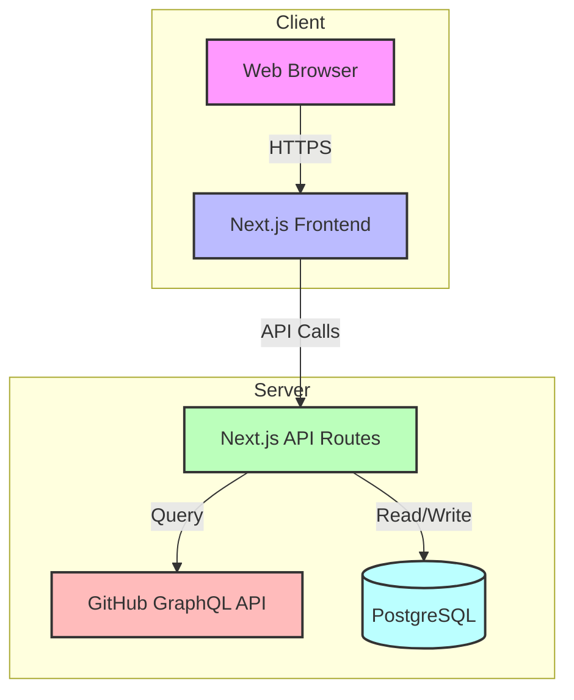
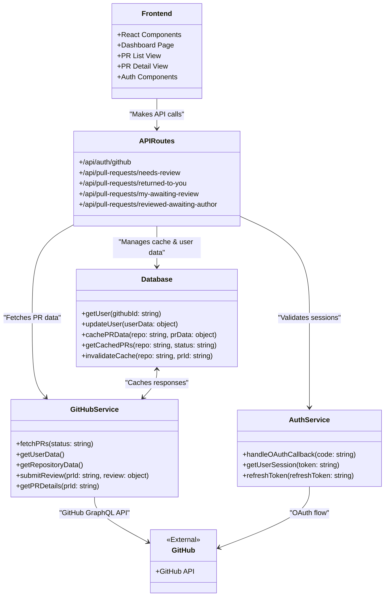
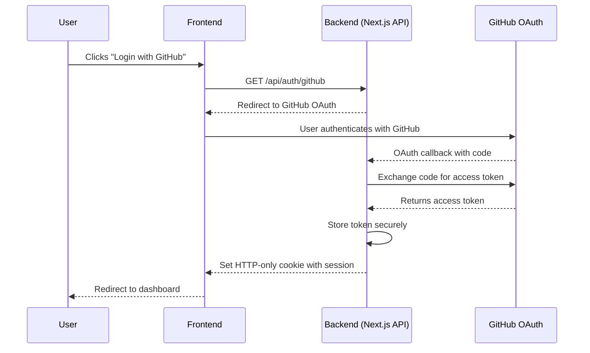
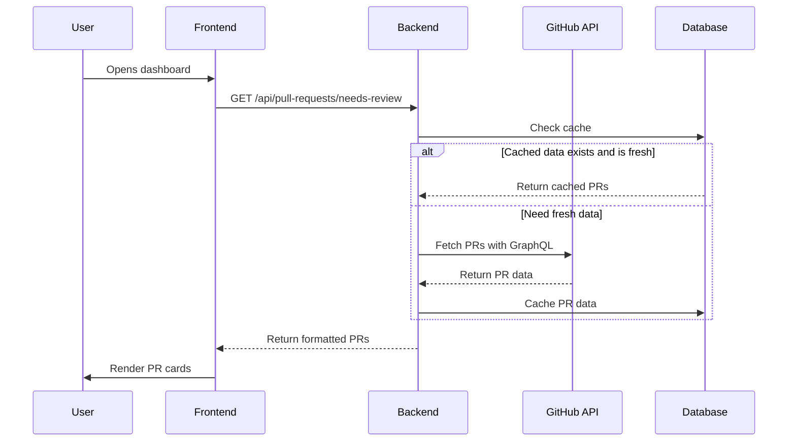
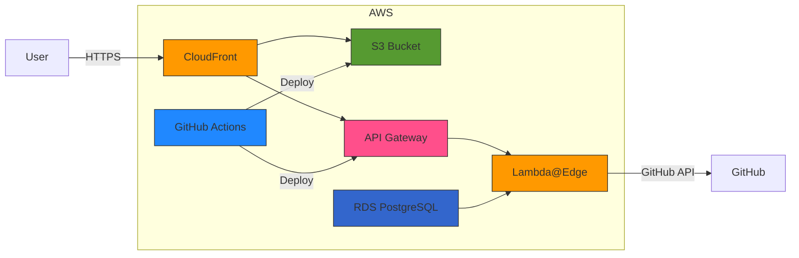
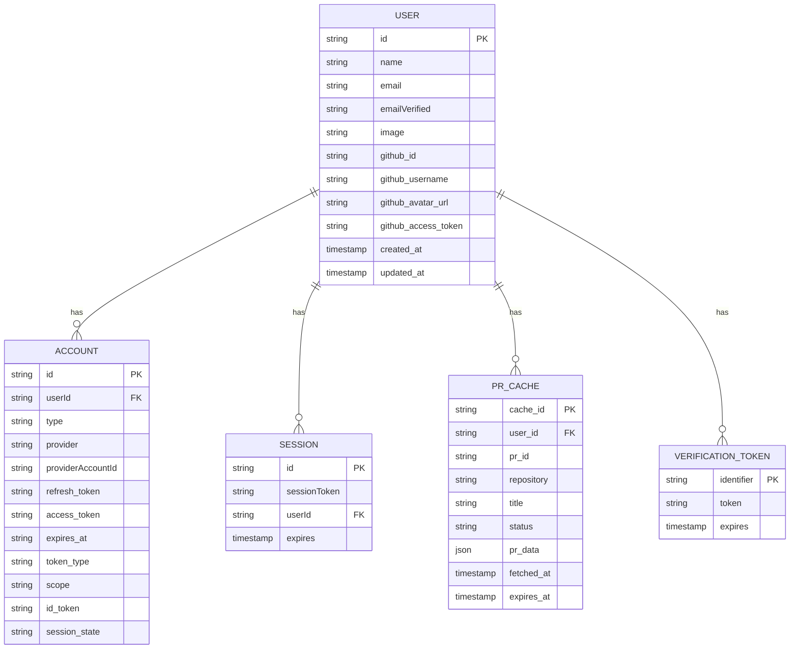
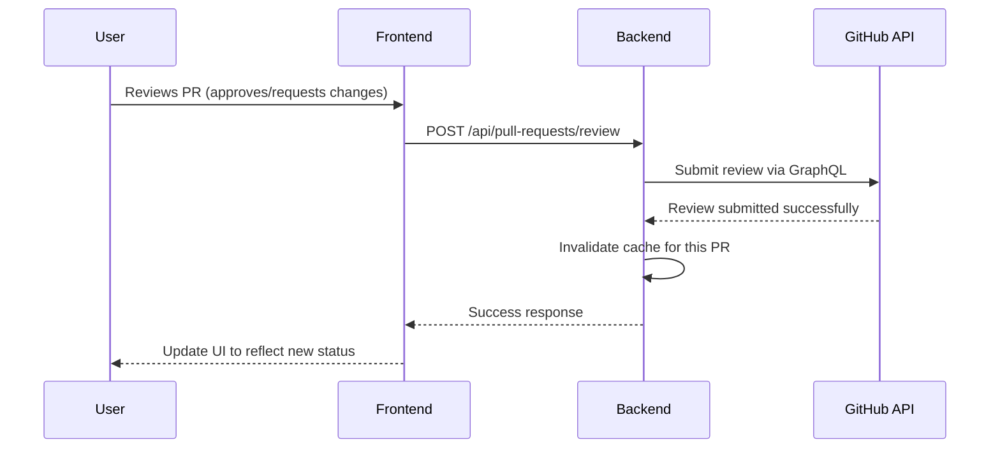

# CodeFlow Architecture Diagrams

## 1. System Architecture Overview

## 2. Component Diagram

## 3. Authentication Flow

## 4. Data Flow for PR Dashboard

## 5. AWS Deployment Architecture

## 6. Database Schema

*Note: Auth.js DB adapter schema is used for authentication and user management. Custom fields are added to the USER table as needed.*

## 7. Component Interaction for PR Status Update

These diagrams provide a comprehensive overview of the CodeFlow system architecture, component interactions, data flows, and deployment strategy. They serve as living documentation that can be updated as the system evolves.
