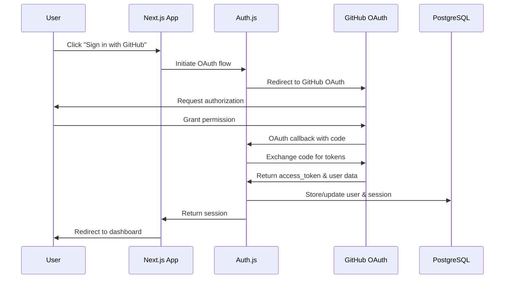

# Backend Architecture

This section defines the serverless backend architecture using Next.js API routes, deployed on AWS Lambda with PostgreSQL database integration.

### Service Architecture

#### Lambda Function Organization

**Next.js API Routes Structure:**
```
app/api/
├── auth/
│   └── [...nextauth]/
│       └── route.ts        # Auth.js configuration
├── profile/
│   └── route.ts            # User profile CRUD
├── repositories/
│   ├── route.ts            # Repository list/create
│   └── [id]/
│       └── route.ts        # Repository update/delete
├── pull-requests/
│   ├── route.ts            # Dashboard data aggregation
│   └── [owner]/
│       └── [repo]/
│           └── [number]/
│               └── route.ts # Individual PR details
├── github/
│   ├── repositories/
│   │   └── route.ts        # GitHub repo search
│   └── rate-limit/
│       └── route.ts        # Rate limit status
└── health/
    └── route.ts            # System health check
```

**API Route Template:**
```typescript
// app/api/pull-requests/route.ts
import { NextRequest, NextResponse } from 'next/server'
import { getServerSession } from 'next-auth'
import { authOptions } from '@/lib/auth'
import { GitHubService } from '@/lib/github'
import { DatabaseService } from '@/lib/database'

export async function GET(request: NextRequest) {
  try {
    // Authentication check
    const session = await getServerSession(authOptions)
    if (!session?.accessToken) {
      return NextResponse.json(
        { error: { code: 'UNAUTHORIZED', message: 'Authentication required' } },
        { status: 401 }
      )
    }

    // Parse query parameters
    const { searchParams } = new URL(request.url)
    const repositoryId = searchParams.get('repository')

    // Get user's monitored repositories
    const db = new DatabaseService()
    const repositories = await db.getUserRepositories(
      session.user.id,
      true // active only
    )

    // Filter by specific repository if requested
    const filteredRepos = repositoryId 
      ? repositories.filter(r => r.id === repositoryId)
      : repositories

    // Fetch dashboard data from GitHub API
    const github = new GitHubService(session.accessToken)
    const dashboardData = await github.getDashboardData(filteredRepos)

    // Update user's last active timestamp
    await db.updateUserLastActive(session.user.id)

    return NextResponse.json(dashboardData)

  } catch (error) {
    console.error('Dashboard API error:', error)
    
    return NextResponse.json(
      { 
        error: { 
          code: 'INTERNAL_ERROR', 
          message: 'Failed to fetch dashboard data',
          timestamp: new Date().toISOString(),
          requestId: crypto.randomUUID()
        } 
      },
      { status: 500 }
    )
  }
}
```

### Database Architecture

#### Data Access Layer (Repository Pattern)

**Database Service Implementation:**
```typescript
// lib/database.ts
import { PrismaClient } from '@prisma/client'
import { Repository, UserProfile } from '@/types/database'

export class DatabaseService {
  constructor(private prisma: PrismaClient = prisma) {}

  // User Profile Management
  async createUserProfile(data: {
    userId: string
    githubId: number
    username: string
  }): Promise<UserProfile> {
    return this.prisma.userProfile.create({
      data: {
        ...data,
        lastActiveAt: new Date(),
      },
    })
  }

  async updateUserLastActive(userId: string): Promise<void> {
    await this.prisma.userProfile.update({
      where: { userId },
      data: { lastActiveAt: new Date() },
    })
  }

  // Repository Management
  async getUserRepositories(
    userId: string, 
    activeOnly = false
  ): Promise<Repository[]> {
    return this.prisma.repository.findMany({
      where: {
        userId,
        ...(activeOnly && { isActive: true }),
      },
      orderBy: { createdAt: 'desc' },
    })
  }

  async addRepository(
    userId: string,
    data: {
      githubId: number
      name: string
      fullName: string
      owner: string
    }
  ): Promise<Repository> {
    return this.prisma.repository.create({
      data: {
        ...data,
        userId,
        isActive: true,
      },
    })
  }

  async updateRepository(
    id: string,
    data: { isActive?: boolean }
  ): Promise<Repository> {
    return this.prisma.repository.update({
      where: { id },
      data,
    })
  }

  async deleteRepository(id: string): Promise<void> {
    await this.prisma.repository.delete({
      where: { id },
    })
  }

  // Cleanup operations
  async cleanupInactiveUsers(daysInactive = 30): Promise<number> {
    const cutoffDate = new Date(Date.now() - daysInactive * 24 * 60 * 60 * 1000)
    
    const inactiveProfiles = await this.prisma.userProfile.findMany({
      where: {
        lastActiveAt: { lt: cutoffDate },
      },
      select: { userId: true },
    })

    // Delete users (cascade will handle profiles and repositories)
    const deleteResult = await this.prisma.user.deleteMany({
      where: {
        id: { in: inactiveProfiles.map(p => p.userId) },
      },
    })

    return deleteResult.count
  }
}
```

#### GitHub API Service

**GitHub Integration Layer:**
```typescript
// lib/github.ts
import { Octokit } from '@octokit/rest'
import { GitHubPullRequest, DashboardCategorizationResult } from '@/types/github'
import { Repository } from '@/types/database'

export class GitHubService {
  private octokit: Octokit

  constructor(private accessToken: string) {
    this.octokit = new Octokit({
      auth: accessToken,
      request: {
        timeout: 10000, // 10 second timeout
      },
    })
  }

  async getDashboardData(repositories: Repository[]): Promise<DashboardCategorizationResult> {
    const allPRs: GitHubPullRequest[] = []
    
    // Fetch PRs from all monitored repositories
    for (const repo of repositories) {
      try {
        const { data: prs } = await this.octokit.pulls.list({
          owner: repo.owner,
          repo: repo.name,
          state: 'open',
          per_page: 100,
        })
        allPRs.push(...prs)
      } catch (error) {
        console.error(`Failed to fetch PRs for ${repo.fullName}:`, error)
        // Continue with other repositories
      }
    }

    // Get current user info
    const { data: user } = await this.octokit.users.getAuthenticated()

    // Categorize PRs
    return this.categorizePRs(allPRs, user.login)
  }

  private async categorizePRs(
    prs: GitHubPullRequest[], 
    username: string
  ): Promise<DashboardCategorizationResult> {
    const needsReview: GitHubPullRequest[] = []
    const returnedToYou: GitHubPullRequest[] = []
    const myPRs: GitHubPullRequest[] = []
    const reviewedAwaiting: GitHubPullRequest[] = []

    for (const pr of prs) {
      // Skip draft PRs for review categories
      const isDraft = pr.draft

      // My PRs - all PRs authored by current user
      if (pr.user.login === username) {
        myPRs.push(pr)

        // Check if changes were requested on my PR
        if (!isDraft && await this.hasChangesRequested(pr, username)) {
          returnedToYou.push(pr)
        }
        continue
      }

      // Skip remaining categorization for drafts
      if (isDraft) continue

      // Needs Review - PRs where user is requested reviewer
      const isReviewRequested = pr.requested_reviewers?.some(
        reviewer => reviewer.login === username
      )
      if (isReviewRequested) {
        needsReview.push(pr)
        continue
      }

      // Reviewed & Awaiting - PRs I've reviewed but author hasn't addressed
      if (await this.hasReviewedAwaitingAuthor(pr, username)) {
        reviewedAwaiting.push(pr)
      }
    }

    return {
      needsReview: this.sortByUpdatedAt(needsReview),
      returnedToYou: this.sortByUpdatedAt(returnedToYou),
      myPRs: this.sortByUpdatedAt(myPRs),
      reviewedAwaiting: this.sortByUpdatedAt(reviewedAwaiting),
    }
  }

  private async hasChangesRequested(pr: GitHubPullRequest, author: string): Promise<boolean> {
    try {
      const { data: reviews } = await this.octokit.pulls.listReviews({
        owner: pr.head.repo.owner.login,
        repo: pr.head.repo.name,
        pull_number: pr.number,
      })

      // Check if latest review requested changes
      const latestReviews = reviews
        .filter(review => review.state === 'CHANGES_REQUESTED')
        .sort((a, b) => new Date(b.submitted_at!).getTime() - new Date(a.submitted_at!).getTime())

      return latestReviews.length > 0
    } catch {
      return false
    }
  }

  private async hasReviewedAwaitingAuthor(pr: GitHubPullRequest, username: string): Promise<boolean> {
    try {
      const { data: reviews } = await this.octokit.pulls.listReviews({
        owner: pr.head.repo.owner.login,
        repo: pr.head.repo.name,
        pull_number: pr.number,
      })

      // Check if I've submitted a review (approved or changes requested)
      const myReviews = reviews.filter(review => 
        review.user?.login === username && 
        ['APPROVED', 'CHANGES_REQUESTED'].includes(review.state)
      )

      return myReviews.length > 0
    } catch {
      return false
    }
  }

  private sortByUpdatedAt(prs: GitHubPullRequest[]): GitHubPullRequest[] {
    return prs.sort((a, b) => 
      new Date(b.updated_at).getTime() - new Date(a.updated_at).getTime()
    )
  }

  async getRateLimit() {
    const { data } = await this.octokit.rateLimit.get()
    return {
      remaining: data.rate.remaining,
      used: data.rate.used,
      limit: data.rate.limit,
      resetAt: new Date(data.rate.reset * 1000).toISOString(),
      isThrottled: data.rate.remaining < 100,
    }
  }

  async searchRepositories(query: string, limit = 50) {
    const { data } = await this.octokit.search.repos({
      q: query,
      per_page: limit,
    })
    
    return data.items
  }
}
```

### Authentication & Authorization Architecture

#### Auth.js Integration

**Authentication Flow:**


**Middleware Implementation:**
```typescript
// middleware.ts
import { withAuth } from 'next-auth/middleware'

export default withAuth(
  function middleware(req) {
    // Additional middleware logic if needed
    console.log('Authenticated request:', req.nextUrl.pathname)
  },
  {
    callbacks: {
      authorized: ({ token, req }) => {
        // Protect dashboard routes
        if (req.nextUrl.pathname.startsWith('/dashboard')) {
          return !!token
        }
        
        // Protect API routes
        if (req.nextUrl.pathname.startsWith('/api/') && 
            !req.nextUrl.pathname.startsWith('/api/auth/')) {
          return !!token
        }
        
        return true
      },
    },
  }
)

export const config = {
  matcher: [
    '/dashboard/:path*',
    '/repositories/:path*',
    '/settings/:path*',
    '/api/profile/:path*',
    '/api/repositories/:path*',
    '/api/pull-requests/:path*',
    '/api/github/:path*',
  ]
}
```

This backend architecture provides a robust, scalable serverless foundation with clear separation of concerns and comprehensive GitHub API integration.

