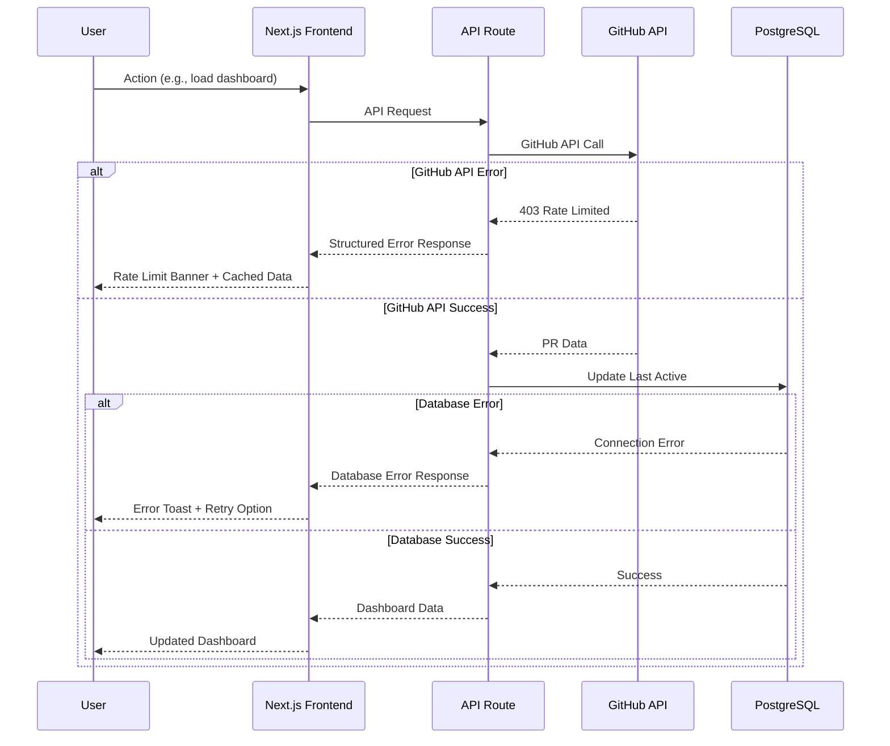

# Error Handling Strategy

This section defines the unified error handling approach across frontend and backend components, ensuring consistent error management and user experience.

### Error Flow Architecture



### Standardized Error Response Format

#### API Error Response Schema

```typescript
// types/api.ts
interface ApiError {
  error: {
    code: string;           // Machine-readable error code
    message: string;        // Human-readable error message
    details?: Record<string, any>; // Additional error context
    timestamp: string;      // ISO datetime
    requestId: string;      // Unique request identifier
    retryable?: boolean;    // Whether request can be retried
  };
}

// Error codes enum
export enum ApiErrorCode {
  // Authentication errors
  UNAUTHORIZED = 'UNAUTHORIZED',
  TOKEN_EXPIRED = 'TOKEN_EXPIRED',
  INVALID_CREDENTIALS = 'INVALID_CREDENTIALS',
  
  // Authorization errors
  FORBIDDEN = 'FORBIDDEN',
  REPOSITORY_ACCESS_DENIED = 'REPOSITORY_ACCESS_DENIED',
  
  // Resource errors
  NOT_FOUND = 'NOT_FOUND',
  REPOSITORY_NOT_FOUND = 'REPOSITORY_NOT_FOUND',
  PULL_REQUEST_NOT_FOUND = 'PULL_REQUEST_NOT_FOUND',
  
  // Validation errors
  INVALID_INPUT = 'INVALID_INPUT',
  MISSING_REQUIRED_FIELD = 'MISSING_REQUIRED_FIELD',
  
  // External service errors
  GITHUB_API_ERROR = 'GITHUB_API_ERROR',
  GITHUB_RATE_LIMITED = 'GITHUB_RATE_LIMITED',
  
  // System errors
  DATABASE_ERROR = 'DATABASE_ERROR',
  INTERNAL_ERROR = 'INTERNAL_ERROR',
  SERVICE_UNAVAILABLE = 'SERVICE_UNAVAILABLE',
}
```

### Backend Error Handling

#### API Route Error Handler

```typescript
// lib/error-handler.ts
import { NextRequest, NextResponse } from 'next/server'
import { ApiError, ApiErrorCode } from '@/types/api'
import { Prisma } from '@prisma/client'

export class AppError extends Error {
  constructor(
    public code: ApiErrorCode,
    message: string,
    public statusCode: number = 500,
    public details?: Record<string, any>,
    public retryable: boolean = false
  ) {
    super(message)
    this.name = 'AppError'
  }
}

export function handleApiError(error: unknown, requestId: string): NextResponse<ApiError> {
  console.error('API Error:', {
    error,
    requestId,
    stack: error instanceof Error ? error.stack : undefined,
  })

  // Handle known application errors
  if (error instanceof AppError) {
    return NextResponse.json(
      {
        error: {
          code: error.code,
          message: error.message,
          details: error.details,
          timestamp: new Date().toISOString(),
          requestId,
          retryable: error.retryable,
        },
      },
      { status: error.statusCode }
    )
  }

  // Handle Prisma errors
  if (error instanceof Prisma.PrismaClientKnownRequestError) {
    if (error.code === 'P2002') {
      return NextResponse.json(
        {
          error: {
            code: ApiErrorCode.INVALID_INPUT,
            message: 'Resource already exists',
            details: { constraint: error.meta?.target },
            timestamp: new Date().toISOString(),
            requestId,
          },
        },
        { status: 409 }
      )
    }

    return NextResponse.json(
      {
        error: {
          code: ApiErrorCode.DATABASE_ERROR,
          message: 'Database operation failed',
          details: { prismaCode: error.code },
          timestamp: new Date().toISOString(),
          requestId,
          retryable: true,
        },
      },
      { status: 500 }
    )
  }

  // Handle GitHub API errors
  if (error && typeof error === 'object' && 'status' in error) {
    const githubError = error as { status: number; message?: string }
    
    if (githubError.status === 403) {
      return NextResponse.json(
        {
          error: {
            code: ApiErrorCode.GITHUB_RATE_LIMITED,
            message: 'GitHub API rate limit exceeded',
            details: { githubStatus: githubError.status },
            timestamp: new Date().toISOString(),
            requestId,
            retryable: true,
          },
        },
        { status: 429 }
      )
    }

    if (githubError.status === 404) {
      return NextResponse.json(
        {
          error: {
            code: ApiErrorCode.NOT_FOUND,
            message: 'GitHub resource not found',
            details: { githubStatus: githubError.status },
            timestamp: new Date().toISOString(),
            requestId,
          },
        },
        { status: 404 }
      )
    }
  }

  // Handle unknown errors
  return NextResponse.json(
    {
      error: {
        code: ApiErrorCode.INTERNAL_ERROR,
        message: 'An unexpected error occurred',
        timestamp: new Date().toISOString(),
        requestId,
        retryable: false,
      },
    },
    { status: 500 }
  )
}

// Wrapper for API routes
export function withErrorHandling(
  handler: (req: NextRequest, context: any) => Promise<NextResponse>
) {
  return async (req: NextRequest, context: any): Promise<NextResponse> => {
    const requestId = crypto.randomUUID()
    
    try {
      return await handler(req, context)
    } catch (error) {
      return handleApiError(error, requestId)
    }
  }
}
```

#### Service Layer Error Handling

```typescript
// lib/github.ts (error handling additions)
export class GitHubService {
  // ... existing methods

  private async makeRequest<T>(
    request: () => Promise<T>,
    operation: string
  ): Promise<T> {
    try {
      return await request()
    } catch (error) {
      if (error && typeof error === 'object' && 'status' in error) {
        const githubError = error as { status: number; message?: string }
        
        switch (githubError.status) {
          case 403:
            throw new AppError(
              ApiErrorCode.GITHUB_RATE_LIMITED,
              'GitHub API rate limit exceeded',
              429,
              { operation, githubStatus: githubError.status },
              true
            )
          case 404:
            throw new AppError(
              ApiErrorCode.NOT_FOUND,
              `GitHub resource not found during ${operation}`,
              404,
              { operation, githubStatus: githubError.status }
            )
          case 401:
            throw new AppError(
              ApiErrorCode.TOKEN_EXPIRED,
              'GitHub access token expired or invalid',
              401,
              { operation }
            )
          default:
            throw new AppError(
              ApiErrorCode.GITHUB_API_ERROR,
              `GitHub API error during ${operation}`,
              500,
              { operation, githubStatus: githubError.status },
              githubError.status >= 500
            )
        }
      }
      
      throw new AppError(
        ApiErrorCode.GITHUB_API_ERROR,
        `Unexpected error during ${operation}`,
        500,
        { operation },
        true
      )
    }
  }

  async getDashboardData(repositories: Repository[]): Promise<DashboardCategorizationResult> {
    return this.makeRequest(
      () => this.fetchDashboardDataInternal(repositories),
      'fetch dashboard data'
    )
  }
  
  // ... other methods wrapped similarly
}
```

### Frontend Error Handling

#### TanStack Query Error Handling

```typescript
// hooks/api/useDashboard.ts (error handling)
import { useQuery } from '@tanstack/react-query'
import { ApiError } from '@/types/api'
import { useToast } from '@/hooks/ui/useToast'

export function useDashboard(repositoryId?: string) {
  const { toast } = useToast()
  
  return useQuery({
    queryKey: ['dashboard', repositoryId],
    queryFn: () => apiRequest<DashboardCategorizationResult>(
      `/pull-requests${repositoryId ? `?repository=${repositoryId}` : ''}`
    ),
    staleTime: 2 * 60 * 1000,
    retry: (failureCount, error) => {
      const apiError = error as ApiError
      
      // Don't retry auth errors
      if (apiError?.error?.code === 'UNAUTHORIZED') return false
      
      // Retry rate limit errors with exponential backoff
      if (apiError?.error?.code === 'GITHUB_RATE_LIMITED') {
        return failureCount < 3
      }
      
      // Retry retryable errors
      if (apiError?.error?.retryable) {
        return failureCount < 2
      }
      
      return false
    },
    retryDelay: (attemptIndex) => Math.min(1000 * 2 ** attemptIndex, 30000),
    onError: (error: ApiError) => {
      const message = error?.error?.message || 'Failed to load dashboard data'
      
      // Don't show toast for rate limits (handled by banner component)
      if (error?.error?.code === 'GITHUB_RATE_LIMITED') return
      
      toast({
        title: 'Error',
        description: message,
        variant: 'destructive',
        action: error?.error?.retryable ? (
          <Button onClick={() => queryClient.invalidateQueries(['dashboard'])}>
            Retry
          </Button>
        ) : undefined,
      })
    },
  })
}
```

#### React Error Boundary

```typescript
// components/ui/ErrorBoundary.tsx
import { Component, ErrorInfo, ReactNode } from 'react'
import { Button } from '@/components/ui'

interface Props {
  children: ReactNode
  fallback?: ReactNode
}

interface State {
  hasError: boolean
  error?: Error
  errorInfo?: ErrorInfo
}

export class ErrorBoundary extends Component<Props, State> {
  constructor(props: Props) {
    super(props)
    this.state = { hasError: false }
  }

  static getDerivedStateFromError(error: Error): State {
    return {
      hasError: true,
      error,
    }
  }

  componentDidCatch(error: Error, errorInfo: ErrorInfo) {
    console.error('Error caught by boundary:', error, errorInfo)
    
    this.setState({
      error,
      errorInfo,
    })

    // Log to monitoring service
    if (process.env.NODE_ENV === 'production') {
      // Send error to CloudWatch or monitoring service
      console.error('Production error:', {
        error: error.message,
        stack: error.stack,
        componentStack: errorInfo.componentStack,
        timestamp: new Date().toISOString(),
      })
    }
  }

  render() {
    if (this.state.hasError) {
      if (this.props.fallback) {
        return this.props.fallback
      }

      return (
        <div className="flex flex-col items-center justify-center min-h-[400px] p-8">
          <h2 className="text-xl font-semibold text-gray-900 mb-2">
            Something went wrong
          </h2>
          <p className="text-gray-600 mb-4 text-center">
            An unexpected error occurred. Please try refreshing the page.
          </p>
          
          <div className="space-x-2">
            <Button
              onClick={() => window.location.reload()}
              variant="primary"
            >
              Refresh Page
            </Button>
            
            {process.env.NODE_ENV === 'development' && (
              <Button
                onClick={() => this.setState({ hasError: false })}
                variant="outline"
              >
                Reset Error Boundary
              </Button>
            )}
          </div>
          
          {process.env.NODE_ENV === 'development' && this.state.error && (
            <details className="mt-4 max-w-2xl">
              <summary className="cursor-pointer text-sm text-gray-500">
                Error Details (Development Only)
              </summary>
              <pre className="mt-2 text-xs bg-gray-100 p-2 rounded overflow-auto">
                {this.state.error.stack}
              </pre>
            </details>
          )}
        </div>
      )
    }

    return this.props.children
  }
}
```

#### Global Error Handler

```typescript
// app/error.tsx (Next.js global error UI)
'use client'

import { useEffect } from 'react'
import { Button } from '@/components/ui'

export default function Error({
  error,
  reset,
}: {
  error: Error & { digest?: string }
  reset: () => void
}) {
  useEffect(() => {
    // Log error to monitoring service
    console.error('Global error:', error)
  }, [error])

  return (
    <div className="flex flex-col items-center justify-center min-h-screen p-8">
      <h2 className="text-2xl font-bold text-gray-900 mb-4">
        Oops! Something went wrong
      </h2>
      
      <p className="text-gray-600 mb-6 text-center max-w-md">
        We apologize for the inconvenience. An unexpected error has occurred.
        Please try again or contact support if the problem persists.
      </p>
      
      <div className="space-x-4">
        <Button onClick={reset} variant="primary">
          Try Again
        </Button>
        
        <Button 
          onClick={() => window.location.href = '/'}
          variant="outline"
        >
          Go Home
        </Button>
      </div>
      
      {error.digest && (
        <p className="text-xs text-gray-400 mt-4">
          Error ID: {error.digest}
        </p>
      )}
    </div>
  )
}
```

