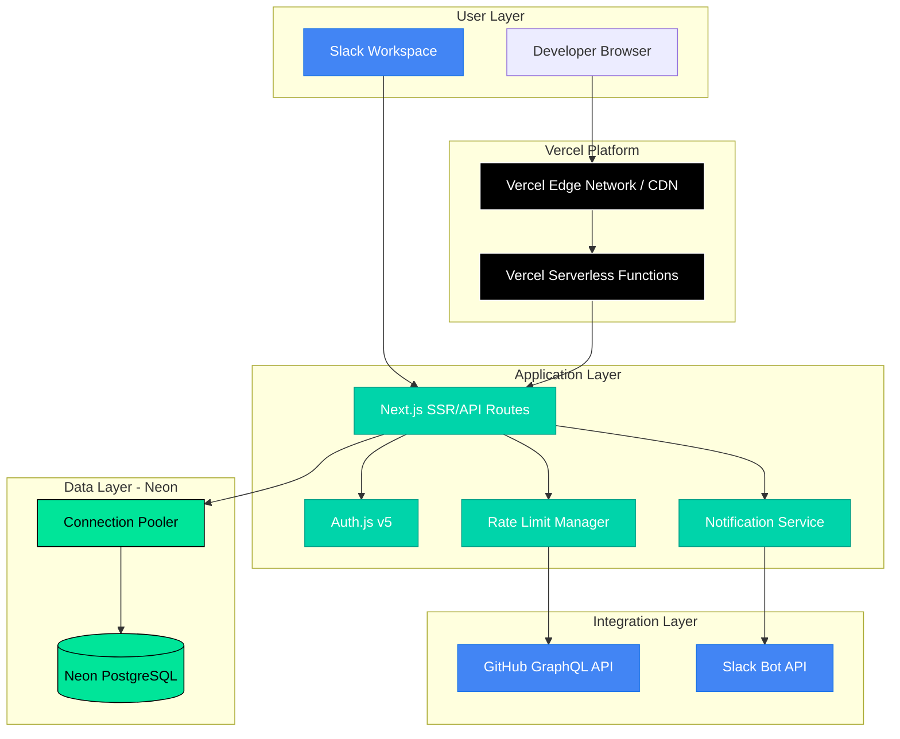

# High Level Architecture

### Technical Summary

CodeFlow employs a **serverless-first Next.js architecture** deployed on **Vercel** with **Neon PostgreSQL** data persistence, optimizing for rapid MVP development while maintaining enterprise scalability. The system implements **intelligent GitHub GraphQL API rate limiting** with mathematical cost calculations and exponential backoff strategies to support 5-50 concurrent users during peak collaboration hours. **Slack integration** via Bot API enables direct messaging and channel notifications for PR status updates, while the **four-section dashboard** provides scan-to-action workflows optimized for developer productivity. The MVP architecture emphasizes **cost efficiency** through Vercel and Neon free-tier optimization, simple database-level caching, and **graceful degradation** during API rate limiting scenarios.

### Platform and Infrastructure Strategy

**Development Approach:** Features-First Architecture  
**Platform Decision:** Vercel + Neon selected for MVP deployment:
- **Vercel**: Zero-config Next.js deployment, automatic preview deployments, global Edge Network ($0/month Hobby tier)
- **Neon**: Serverless PostgreSQL with built-in connection pooling, auto-suspend, instant wake ($0/month free tier)

**Current Focus:** Next.js application development with Vercel-native deployment  
**Key Services:** Vercel Functions (serverless), Neon PostgreSQL, Vercel Edge Network (CDN), Auth.js authentication

**Rationale:** Vercel + Neon provides the fastest path to production with zero infrastructure management, zero cost for MVP, and 5-minute deployment cycles. Migration to AWS/enterprise infrastructure remains straightforward if commercial scaling demands require it.

### Repository Structure

**Structure:** Monorepo with clear module separation  
**Monorepo Tool:** npm workspaces (lightweight, Next.js compatible)  
**Package Organization:** Apps (web, api) + shared packages (types, utils, ui components)

**Rationale:** Monorepo accelerates MVP development through shared TypeScript interfaces and simplified deployment pipeline, while maintaining clear boundaries for future microservices migration if scaling demands require it.

### High Level Architecture Diagram

### Architectural Patterns

- **Serverless Architecture:** Vercel Functions for compute with automatic scaling - _Rationale:_ Optimal for variable load patterns and cost efficiency during MVP phase
- **API Gateway Pattern:** Single Next.js API entry point with route-based organization - _Rationale:_ Centralized rate limiting, authentication, and monitoring
- **Repository Pattern:** Abstract data access for PR and user management - _Rationale:_ Enables testing and supports future database scaling strategies
- **Circuit Breaker Pattern:** Graceful degradation during GitHub API rate limiting - _Rationale:_ Maintains service availability with cached data during API constraints
- **Event-Driven Notifications:** Slack integration via Bot API with webhook support - _Rationale:_ Real-time PR status updates without constant polling overhead, faster approval process than Microsoft Graph API

