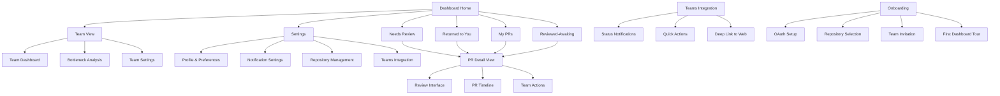
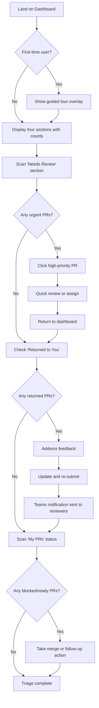
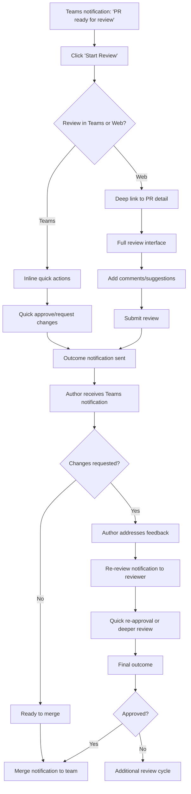

# CodeFlow UI/UX Specification

This document defines the user experience goals, information architecture, user flows, and visual design specifications for CodeFlow's user interface. It serves as the foundation for visual design and frontend development, ensuring a cohesive and user-centered experience.

## Overall UX Goals & Principles

### Target User Personas

**Primary: Mid-Size Development Team Members (5-15 developers)**
Software engineers using GitHub for code review and Microsoft Teams for daily communication. They work on shared repositories with moderate-to-high PR volume (10-50 PRs weekly). Currently spend 20+ minutes daily triaging PR notifications and lose track of PR status between review cycles.

**Secondary: Enterprise Development Team Members (15+ developers)** 
Engineers in larger organizations with multiple repositories, complex review requirements, and distributed teams across time zones. They handle hundreds of PR notifications weekly with complex ownership models and cross-team coordination challenges.

### Usability Goals

- **Individual Efficiency:** Power users complete PR triage in under 3 clicks; new users get guided assistance  
- **Cognitive Load Reduction:** Process 2x more PRs in same mental effort with intelligent categorization
- **Team Coordination:** Managers gain team bottleneck visibility without micromanaging individual developers
- **Rapid Onboarding:** New team members productive within first session, existing users easily invite teammates
- **Enterprise Ready:** Scales from 5 to 500 developers with security and compliance built-in

### Design Principles

1. **Outcome-focused clarity** - Show what needs to be done, with graceful handling of unclear states
2. **Progressive expertise** - Support novice guidance and expert efficiency simultaneously  
3. **Transparent team dynamics** - Surface collaboration patterns without sacrificing individual privacy
4. **Contextual communication** - Deliver notifications where developers work, with enterprise controls
5. **Scalable zero-setup** - Work immediately for individuals, scale to enterprise without reconfiguration

### Change Log

| Date | Version | Description | Author |
|------|---------|-------------|--------|
| 2025-09-09 | 1.0 | Initial specification with stakeholder-refined UX goals | UX Expert |

## Information Architecture (IA)

### Site Map / Screen Inventory

### Navigation Structure

**Primary Navigation:** Four-section dashboard tabs with persistent visibility - "Needs Review" (with count badge), "Returned to You" (with urgency indicator), "My PRs" (with status overview), "Reviewed-Awaiting" (with time since last action)

**Secondary Navigation:** Contextual actions within each section - Filter/Sort controls, Team view toggle (for managers), Settings access, Help/Tutorial access for new users

**Breadcrumb Strategy:** Minimal breadcrumbs for deep navigation (Dashboard > PR Detail > Review Interface), with quick "Back to Dashboard" action always available. Teams integration uses deep linking to maintain context when users click through from notifications.

## User Flows

### Daily PR Triage

**User Goal:** Quickly identify and prioritize all PRs requiring immediate attention across multiple repositories

**Entry Points:** Direct URL, Teams notification click, browser bookmark, scheduled daily routine

**Success Criteria:** Complete assessment of all actionable PRs in under 3 minutes, clear next actions identified

#### Flow Diagram

#### Edge Cases & Error Handling:
- **Stale data:** Show "Last updated X minutes ago" with refresh button
- **API rate limits:** Graceful degradation with cached data and retry mechanism
- **Mixed permissions:** Clear indication when user can't access certain PRs
- **Overwhelming volume:** Progressive loading with "Show more" controls
- **Unclear status:** "Status unclear - check GitHub" with direct link

### Review Cycle Completion

**User Goal:** Complete a review cycle from initial notification through final approval/merge

**Entry Points:** Teams notification, dashboard "Needs Review", email fallback

**Success Criteria:** Review completed with clear outcome communicated to author and team

#### Flow Diagram

#### Edge Cases & Error Handling:
- **Reviewer offline:** Escalation to secondary reviewers after defined timeout
- **Conflicting reviews:** Clear conflict resolution UI with team discussion thread
- **Large changesets:** Progressive loading with file-by-file review capability
- **External dependencies:** Integration status indicators with clear waiting states
- **Review fatigue:** Smart assignment rotation suggestions

## Wireframes & Mockups

**Primary Design Files:** Design files will be created in Figma with collaborative access for development team

### Key Screen Layouts

#### Dashboard Home
**Purpose:** Central hub for all PR management activities with four-section layout optimized for quick scanning

**Key Elements:**
- Header with user avatar, repository selector, and settings access
- Four-section grid: "Needs Review" (top-left), "Returned to You" (top-right), "My PRs" (bottom-left), "Reviewed-Awaiting" (bottom-right)
- Each section shows count badge, priority indicators, and "View All" expansion
- Team view toggle for managers (collapsed by default for individual contributors)
- Global search and filter controls
- Real-time update indicator with last refresh timestamp

**Interaction Notes:** Hover states reveal quick actions (approve, request changes, view details). Click-to-expand shows first 5 items inline, "View All" opens dedicated section view.

**Design File Reference:** [To be created in Figma - Dashboard wireframes]

#### PR Detail View
**Purpose:** Comprehensive view of individual PR with all review information and actions

**Key Elements:**
- PR header with title, author, branch info, and status badges
- File changes navigator with diff preview
- Review comments timeline with threaded discussions
- Action bar with review controls (Approve, Request Changes, Comment)
- Reviewer assignment and Teams notification controls
- Related PRs and dependency indicators

**Interaction Notes:** Inline comment creation, collapsible file diffs, smart notification preferences based on user role

**Design File Reference:** [To be created in Figma - PR Detail screens]

#### Teams Integration Cards
**Purpose:** Rich notification cards within Microsoft Teams with actionable controls

**Key Elements:**
- PR summary with key metadata (author, repository, urgency)
- Status indicator and change summary
- Quick action buttons (Start Review, Quick Approve, View Details)
- Deep link to web interface for complex actions

**Interaction Notes:** Buttons trigger actions directly in Teams when possible, graceful fallback to web interface for complex workflows

**Design File Reference:** [To be created in Figma - Teams integration mockups]

## Component Library / Design System

**Design System Approach:** Custom component library built on modern design principles, optimized for developer productivity tools. Focus on high contrast, clear information hierarchy, and efficient interaction patterns.

### Core Components

#### PR Card Component
**Purpose:** Standardized display unit for pull request information across all dashboard sections

**Variants:** Compact (dashboard), Detailed (section views), Teams (notification cards)

**States:** Unread, Read, Urgent, Approved, Changes Requested, Merged, Draft

**Usage Guidelines:** Always include status indicator, author, and time-based information. Use color coding for urgency, not status (accessibility consideration).

#### Status Badge System
**Purpose:** Consistent visual language for PR states and review outcomes

**Variants:** Review Status (Pending, Approved, Changes Requested), Priority (High, Medium, Low), Merge Status (Ready, Blocked, Merged)

**States:** Default, Active, Disabled, Loading

**Usage Guidelines:** Combine with icons for accessibility, use consistent color mapping, include tooltips for complex states.

#### Action Button Groups
**Purpose:** Consistent interaction patterns for review actions

**Variants:** Primary Actions (Approve, Request Changes), Secondary Actions (Comment, Assign), Quick Actions (Teams integration)

**States:** Default, Hover, Active, Disabled, Loading

**Usage Guidelines:** Primary actions always visible, secondary actions progressive disclosure, loading states maintain button size.

## Branding & Style Guide

### Visual Identity
**Brand Guidelines:** Clean, professional aesthetic aligned with developer tool expectations. High contrast for accessibility, efficient use of screen real estate.

### Color Palette

| Color Type | Hex Code | Usage |
|------------|----------|--------|
| Primary | #0366d6 | Primary actions, links, GitHub brand alignment |
| Secondary | #586069 | Secondary text, borders, inactive states |
| Accent | #28a745 | Success states, approvals, positive feedback |
| Success | #28a745 | Positive feedback, confirmations |
| Warning | #ffd33d | Cautions, important notices |
| Error | #d73a49 | Errors, destructive actions |
| Neutral | #f6f8fa, #24292e | Text, borders, backgrounds |

### Typography

#### Font Families
- **Primary:** -apple-system, BlinkMacSystemFont, 'Segoe UI', 'Noto Sans', Helvetica, Arial, sans-serif
- **Secondary:** Same as primary (simplified stack)
- **Monospace:** 'SFMono-Regular', Consolas, 'Liberation Mono', Menlo, monospace

#### Type Scale

| Element | Size | Weight | Line Height |
|---------|------|---------|-------------|
| H1 | 32px | 600 | 1.25 |
| H2 | 24px | 600 | 1.25 |
| H3 | 20px | 600 | 1.25 |
| Body | 14px | 400 | 1.5 |
| Small | 12px | 400 | 1.4 |

### Iconography
**Icon Library:** GitHub Octicons for consistency with developer expectations, supplemented with Heroicons for additional UI elements

**Usage Guidelines:** 16px icons for UI elements, 20px for primary actions, maintain 2px stroke width for custom icons

### Spacing & Layout
**Grid System:** 8px base unit system with 16px, 24px, 32px, 48px major intervals

**Spacing Scale:** 4px, 8px, 12px, 16px, 24px, 32px, 48px, 64px progression

## Accessibility Requirements

### Compliance Target
**Standard:** WCAG 2.1 AA compliance with select AAA requirements for critical workflows

### Key Requirements

**Visual:**
- Color contrast ratios: 4.5:1 minimum for normal text, 3:1 for large text
- Focus indicators: 2px solid outline with 2px offset, high contrast color
- Text sizing: Supports zoom up to 200% without horizontal scrolling

**Interaction:**
- Keyboard navigation: Full functionality accessible via keyboard with logical tab order
- Screen reader support: Semantic HTML, proper ARIA labels, meaningful alt text
- Touch targets: Minimum 44px touch targets on mobile interfaces

**Content:**
- Alternative text: Descriptive alt text for all informational images and icons
- Heading structure: Proper H1-H6 hierarchy for content organization
- Form labels: Explicit labels for all form inputs with error state descriptions

### Testing Strategy
Automated testing with axe-core, manual testing with screen readers (NVDA, JAWS, VoiceOver), keyboard-only navigation testing, color contrast validation

## Responsiveness Strategy

### Breakpoints

| Breakpoint | Min Width | Max Width | Target Devices |
|------------|-----------|-----------|----------------|
| Mobile | 320px | 767px | Smartphones, small tablets |
| Tablet | 768px | 1023px | Tablets, small laptops |
| Desktop | 1024px | 1439px | Standard desktops, laptops |
| Wide | 1440px | - | Large monitors, ultrawide displays |

### Adaptation Patterns

**Layout Changes:** Four-section grid becomes single-column stacked layout on mobile, two-column on tablet, maintains four-section grid on desktop+

**Navigation Changes:** Hamburger menu for mobile navigation, tab navigation on tablet+, persistent navigation on desktop

**Content Priority:** Most urgent PRs surface first on mobile, progressive disclosure for secondary information, maintain all functionality across breakpoints

**Interaction Changes:** Touch-optimized controls on mobile/tablet, hover states on desktop, swipe gestures for mobile navigation

## Animation & Micro-interactions

### Motion Principles
Subtle, purposeful animations that provide feedback and guide attention. Respect user preferences for reduced motion. Duration scaled to content complexity.

### Key Animations
- **Loading states:** Skeleton loading for PR cards (800ms duration, ease-out easing)
- **State transitions:** Status badge changes with smooth color transition (300ms duration, ease-in-out easing)
- **Navigation:** Section transitions with slide effect (400ms duration, ease-out easing)
- **Notifications:** Toast notifications with slide-in from top (300ms enter, 200ms exit, ease-out easing)
- **Hover feedback:** Subtle scale and shadow effects on interactive elements (150ms duration, ease-out easing)

## Performance Considerations

### Performance Goals
- **Page Load:** Initial dashboard load under 2 seconds on 3G connection
- **Interaction Response:** UI feedback within 100ms, data updates within 500ms
- **Animation FPS:** Maintain 60fps for all animations and transitions

### Design Strategies
Progressive loading with skeleton screens, lazy loading for PR details, efficient caching strategy for frequently accessed data, optimized image assets and icon sprite sheets, minimal JavaScript bundle sizes with code splitting

## Next Steps

### Immediate Actions
1. Create detailed Figma wireframes and high-fidelity mockups based on this specification
2. Validate design concepts with target users (5-person development team)
3. Create interactive prototype for key user flows (dashboard navigation, PR review process)
4. Review accessibility requirements with development team and establish testing procedures
5. Define component specifications for development handoff
6. Set up design system documentation and asset library

### Design Handoff Checklist
- [x] All user flows documented with wireframes
- [x] Component inventory complete with specifications
- [x] Accessibility requirements defined with testing strategy
- [x] Responsive strategy clear with breakpoints and adaptation patterns
- [x] Brand guidelines incorporated with color and typography systems
- [x] Performance goals established with measurable targets
